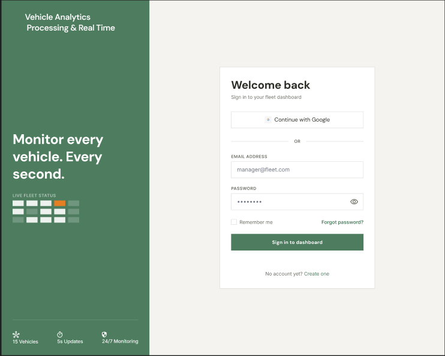
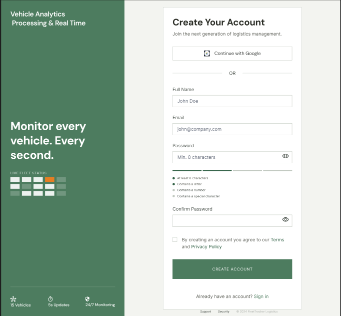
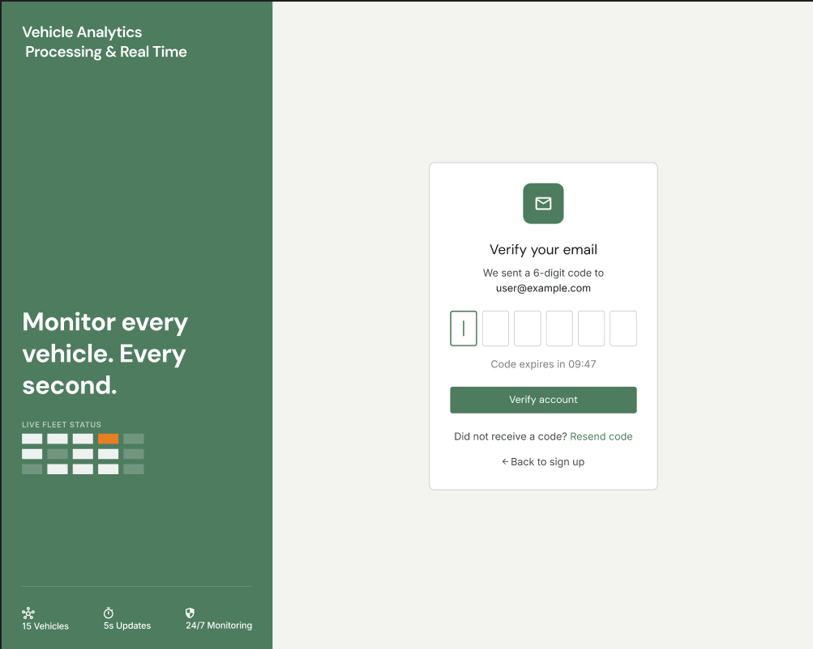
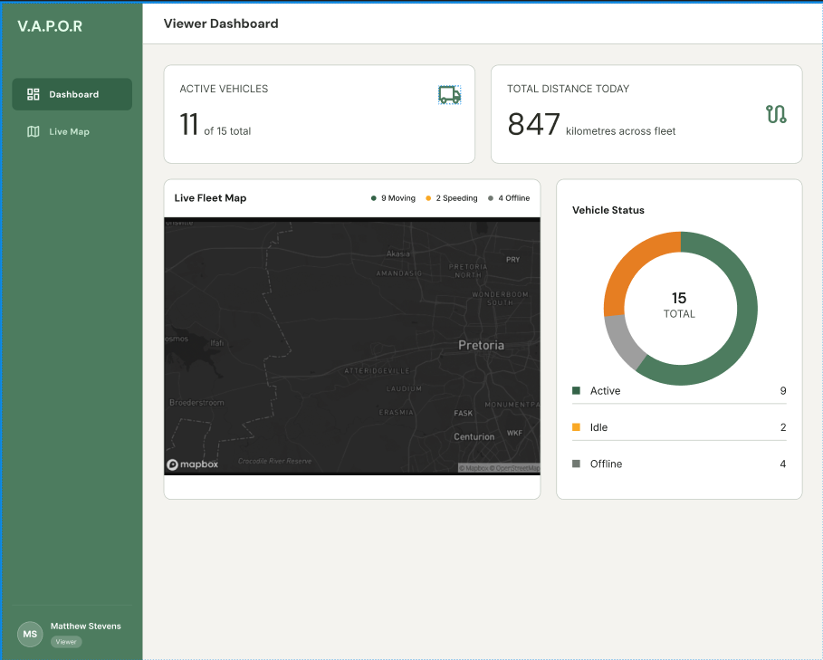
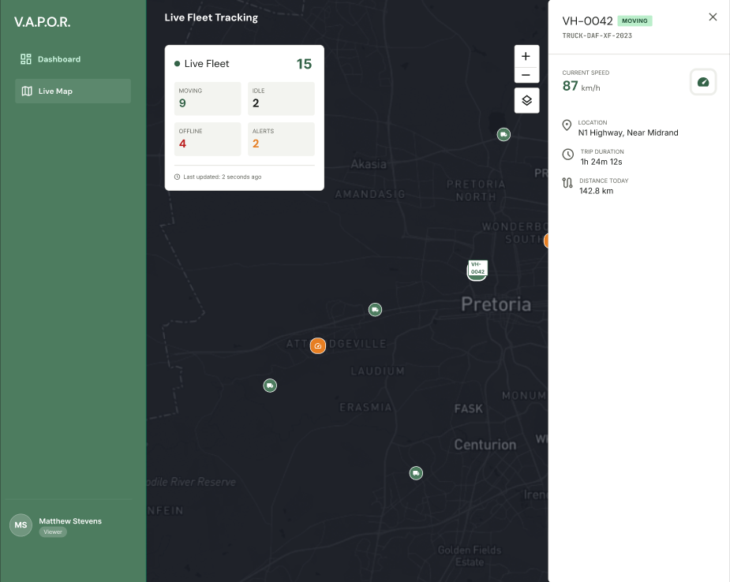
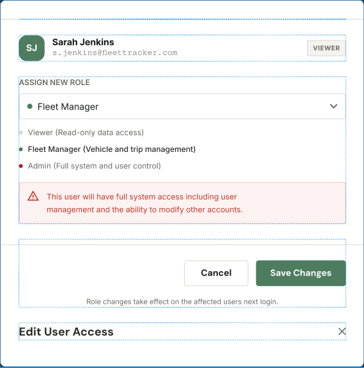

## 1. Login Page
**Annotations:**
This screen authenticates existing users with their email and password, offering access recovery options and integration with Google OAuth to streamline access.

**Screen Layouts & Component Placement:**
The interface utilizes a split-screen layout. 
**Left Pane:** Features a solid dark green background containing the V.A.P.O.R branding, a "Monitor every vehicle. Every second." tagline, and visual live fleet status indicators.
**Right Pane:** Centers the interactive elements. From top to bottom, it contains a "Welcome back" header, a "Continue with Google" button, an "OR" divider, an Email Address input field, a Password input field with a visibility icon, a "Remember me" checkbox paired with a "Forgot password?" link, a primary "Sign in to dashboard" action button, and a "No account yet? Create one" link at the bottom.

**User Interaction Points:**
* Users input credentials into the email and password text fields. 
* Clicking the eye icon in the password field triggers a visibility toggle.
* Clicking "Sign in to dashboard" triggers system authentication.

**Navigation Flow:**
* Successful login directs the user to their designated role-based dashboard.
* Clicking the registration link navigates the user to the Registration Page.

**Wireframe:**

---

## 2. Registration Page

**Annotations:**
This page allows new users to create an account by collecting necessary details and enforcing strong password requirements to ensure system security.

**Screen Layouts & Component Placement:**
Maintains the split-screen design of the Login page.
**Right Pane:** Displays a "Create Your Account" header followed by a Google OAuth button and an "OR" divider. Below this are input fields for Full Name, Email, and Password. Beneath the password field is a segmented visual strength indicator and a bulleted password requirements checklist. This is followed by a Confirm Password field, a Terms and Privacy Policy checkbox, a "CREATE ACCOUNT" button, and a "Sign in" link.

**User Interaction Points:**
* Users input their personal data into the forms.
* Typing in the password field triggers real-time system feedback, updating the visual strength bar and checking off requirements dynamically.

**Navigation Flow:**
* Submitting valid registration details navigates the user to the Email Verification Page.
* Clicking "Sign in" returns the user to the Login Page.

**Wireframe:**

---

## 3. Email Verification Page

**Annotations:**
This screen prompts users to verify their identity by entering a time-sensitive 6-digit OTP sent to their registered email address.

**Screen Layouts & Component Placement:**
Follows the established split-screen layout.
* **Right Pane:** Centers a clean verification card. It features a prominent envelope icon, a "Verify your email" header, and a subtitle displaying the user's email. Below this are six distinct square input boxes for the OTP, an expiry timer (e.g., "Code expires in 09:47"), a green "Verify account" button, a "Resend code" link, and a "<- Back to sign up" link.

**User Interaction Points:**
* Users input data into the 6-digit OTP boxes.
* If the timer expires, clicking "Resend code" triggers the system to issue a new OTP.

**Navigation Flow:**
* Successful verification flows the user into their respective dashboard.
* Clicking "Back to sign up" reverses the flow to the Registration Page.

**Wireframe:**

---

## 4. Viewer Dashboard

**Annotations:**
A read-only overview designed for fleet viewers to monitor high-level fleet metrics and active locations without editing capabilities.

**Screen Layouts & Component Placement:**
A full-width dashboard layout. 
- **Left Sidebar:** Contains the V.A.P.O.R header, "Dashboard" and "Live Map" navigation links, and the user's profile badge (e.g., "Matthew Stevens, Viewer") at the bottom.
- **Main Content Area:** The top row displays two large Key Performance Indicator (KPI) cards: Active Vehicles and Total Distance Today. The bottom section is split between a wide "Live Fleet Map" (displaying moving, speeding, and offline dots) on the left, and a "Vehicle Status" donut chart on the right.

**User Interaction Points:**
- Users receive visual system feedback via the real-time map markers.
- Interacting with the map triggers pan and zoom controls.

**Navigation Flow:**
- Selecting "Live Map" from the sidebar navigates the user to a dedicated full-screen map view.

**Wireframe:**

---

## 5. Live Fleet Tracking (Live Map)

**Annotations:**
A full-screen geographic view for detailed tracking, providing immediate situational awareness of the entire fleet's current positions.

**Screen Layouts & Component Placement:**
- **Main Content Area:** The screen is dominated by a dark-themed geographic map.
- **Overlays:** A floating "Live Fleet" summary card sits in the top left, displaying counts for Moving, Idle, Offline, and Alerts, along with a "Last updated" timestamp. 
- **Slide-out Panel:** A white panel on the right side displays specific details for a selected vehicle (Current Speed, Location, Trip Duration, Distance Today), with an 'X' button in the top right.

**User Interaction Points:**
- Clicking a vehicle marker on the map triggers the right-side details panel to open.
- Clicking the 'X' button triggers the panel to close.

**Navigation Flow:**
* Users use the persistent left sidebar to navigate back to the main Dashboard view.

**Wireframe:**

---

## 6. Manager Dashboard

**Annotations:**
An operational interface for fleet managers that expands on viewer metrics by adding event tracking and historical daily activity data.

**Screen Layouts & Component Placement:**
- **Main Content Area:** The top row features four KPI cards: Active Vehicles, Total Distance Today, Registered Users, and Data Feed Status. The middle section is horizontally split between a "Fleet Status" donut chart and a "Most Active Vehicles Today" data table. The bottom section contains a vertically stacked "Recent Vehicle Events" list and a "Fleet Activity Today" bar chart.

**User Interaction Points:**
- The dashboard widgets trigger automatic updates, providing passive system feedback.

**Navigation Flow:**
- Follows standard sidebar navigation between the dashboard and map views.

**Wireframe:**

---

## 7. Admin Dashboard

**Annotations:**
A system administration interface that provides full platform oversight, including the necessary tools for access control and personnel management.

**Screen Layouts & Component Placement:**
Shares the structure of the Manager Dashboard but integrates an additional management layer.
- **User Management Section:** Positioned directly below the top KPI cards, this section includes an "Add User" and "Export" button aligned to the right. Below the buttons is a comprehensive data table with columns for Name, Email, Role, Status, Last Active, and Actions (Edit/Deactivate). 

**User Interaction Points:**
- Administrators trigger account modifications by clicking "Edit" or "Deactivate" text links within the user table.
- Clicking "Export" triggers the system to download a user list report.

**Navigation Flow:**
- Clicking "Edit" or "Add User" triggers a modal overlay, keeping the user on the current screen rather than navigating away.

**Wireframe:**

---

## 8. User Role Assignment Modal

**Annotations:**
A pop-up overlay used to securely assign or modify user privileges, explicitly warning administrators when granting full system access.

**Screen Layouts & Component Placement:**
This is a centered modal window overlaying the main dashboard. 
- **Modal Content:** It features an "Edit User Access" title at the bottom, and the user's name/email at the top. The core form contains an "ASSIGN NEW ROLE" dropdown, followed by grey text explaining the roles. If "Admin" is selected, a red warning box appears below the descriptions. "Cancel" and "Save Changes" action buttons are positioned at the bottom right.

**User Interaction Points:**
* Selecting a new role from the dropdown inputs data into the form.
* Selecting the "Admin" role triggers conditional system feedback by displaying the red warning box.
* Clicking "Save Changes" triggers the system to update the database.

**Navigation Flow:**
* Clicking "Cancel" or "Save Changes" closes the modal, returning focus to the underlying Admin Dashboard.

**Wireframe:**
