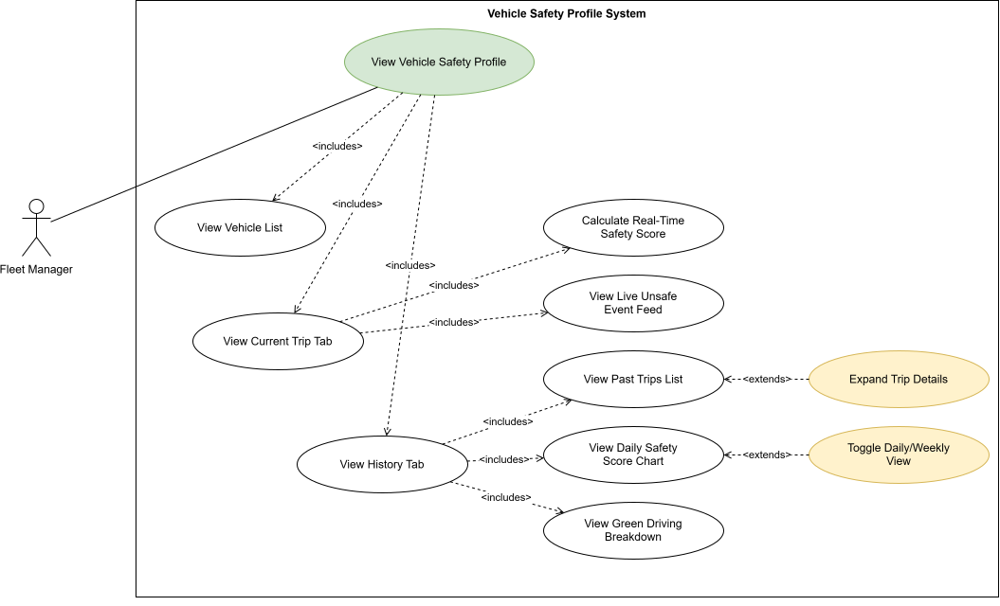
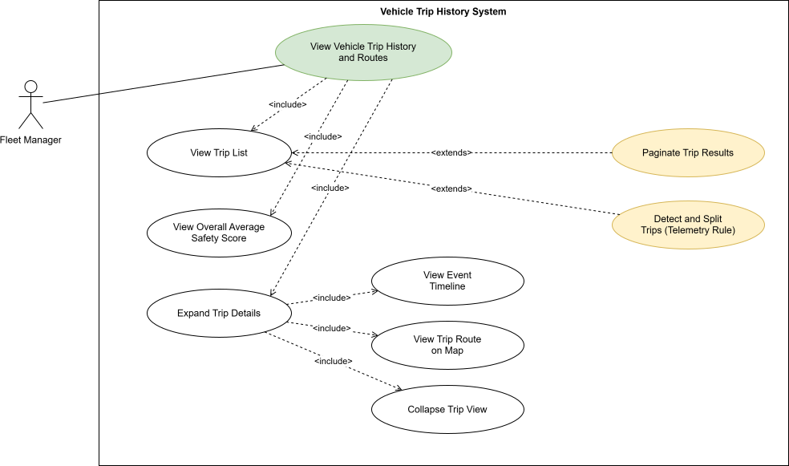
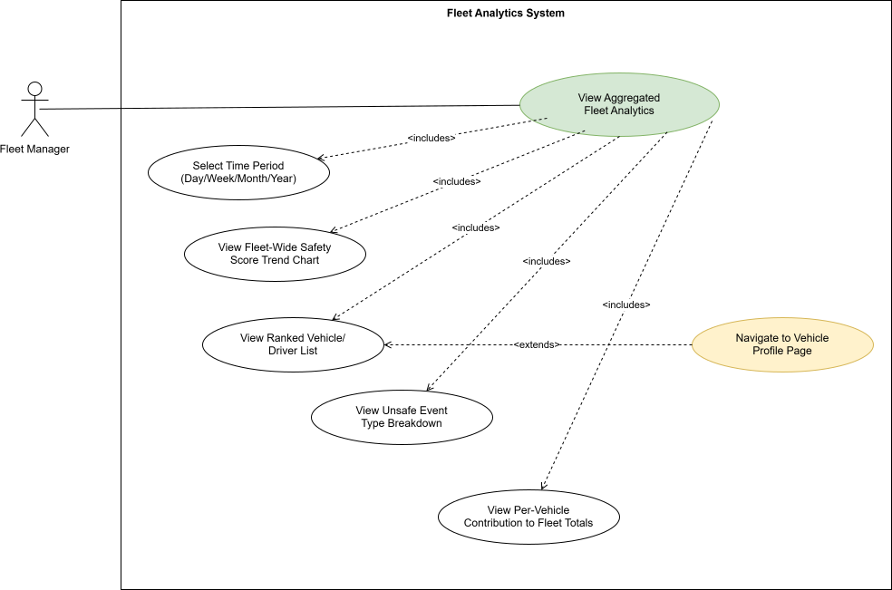
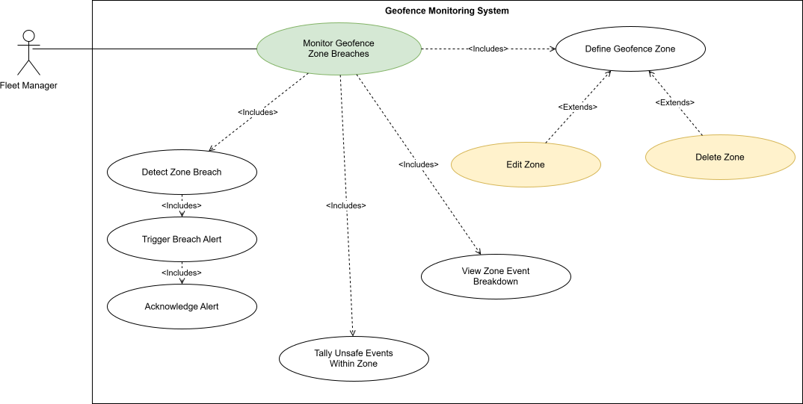
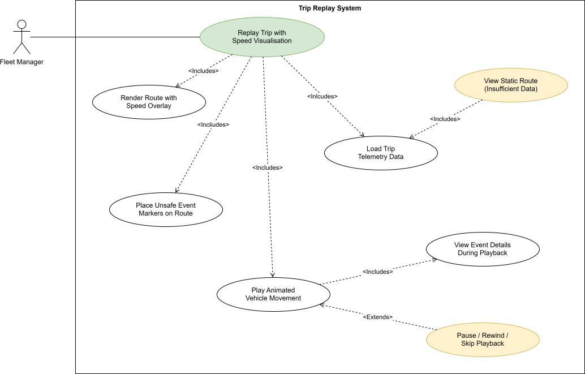
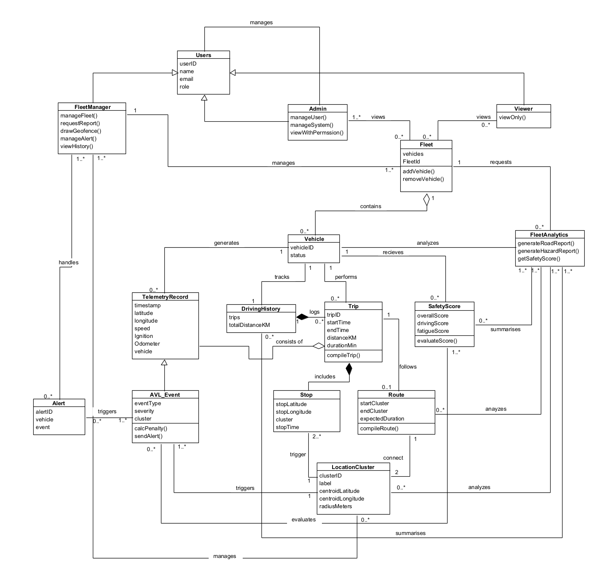

# 3.1.1 Introduction

## Vehicle Analytics Platform - V.A.P.O.R.

---

## Business Need

Modern fleet operators collect massive amounts of raw vehicle telemetry - GPS coordinates, speed readings, braking events, and more. But collecting data is not the same as understanding it. Without proper analysis, fleet managers are left reacting to incidents after they happen rather than preventing them.

**The problem is simple:** Raw location data alone is not enough. Fleet managers need actionable insights to run efficient, safe, and cost-effective operations. They need to know:

- Which drivers are driving safely and which ones need coaching
- Where vehicles are in real-time
- What incidents occurred and where
- How the fleet is performing overall

**The gap:** Most fleet operators don't have a unified way to collect, analyze, and interpret vehicle telemetry data. Unsafe driving behaviour goes undetected. Valuable data goes unused. Fleet performance cannot be systematically measured or improved.

---

## Project Scope

V.A.P.O.R. (Vehicle Analytics, Processing and Operations in Real-time) solves this problem by transforming raw vehicle telemetry into actionable intelligence.

### What the platform does:

- Ingests real-time telemetry from 50+ vehicles via AWS Kinesis streams
- Processes data through serverless Lambda functions
- Calculates driver safety scores based on harsh braking, acceleration, cornering, and crash events
- Stores time-series data in PostgreSQL with TimescaleDB
- Provides real-time dashboards with live vehicle tracking and safety monitoring

### Who it's for:

- **Fleet Managers:** Monitor fleet performance, view safety scores, track vehicles, and identify issues
- **Administrators:** Manage users, configure system settings, and oversee the platform
- **Viewers:** Read-only access to dashboards and reports

### What it delivers:

- Real-time vehicle positions on an interactive map
- Driver safety scores updated daily
- Trip history with route playback
- Fleet analytics and performance reports
- Geo-fencing with entry/exit alerts
- Secure REST API for integration

**The bottom line:** The platform turns raw telemetry into meaningful operational intelligence that helps fleet operators run safer, more efficient operations.

---

# 3.1.2 User Stories (US) / User Characteristics

## User Characteristics

- **Fleet Manager:** The primary user of the system. Fleet managers monitor day-to-day fleet operations. They track live vehicle positions, reviewing driver safety scores, investigating trip history and unsafe events, configuring geofence zones, and reviewing aggregated fleet analytics. This role has full read access to all vehicles, trips, and reports, and can create/edit/delete geofence zones.

- **Administrator:** Responsible for system configuration and user management rather than day-to-day monitoring. Administrators create and manage user accounts and assign roles. 

- **Viewer:** A read-only role intended for any user who needs visibility into fleet performance without the ability to make changes. Viewers can access dashboards, safety scores, and reports, but cannot configure zones, edit vehicles, or manage users.

### US06: View Driver Safety Profile

**As a** fleet manager  
**I want to** view a detailed safety profile for any vehicle in my fleet 
**So that** I can monitor that vehicle's current trip performance in real time and review its full safety history to identify patterns and take corrective action

**Acceptance Criteria:**
* Fleet manager can navigate to the Vehicles tab and see all registered vehicles with their current status and safety score.
* Clicking a vehicle opens its profile page.
* If the vehicle is currently on a trip, the current trip tab is shown by default with a live-updating safety score.
* The current trip tab shows current speed, live GPS location, elapsed trip time, and a live feed of unsafe events for this trip.
* The History Tab shows a list of all the past completed trips with the date, start time, end time, distance, and trip safety score.
* The vehicle's overall average safety score is displayed at the bottom of the History Tab.
* Any trip in the History list can be expanded to show a detailed event timeline and route map.
* If the vehicle has no active trip, the Current Trip tab shows "vehicle not currently active" message.
* The History tab displays a daily safety score chart showing the vehicle's average score per day over a scalable time period
* Each trip in the History list shows a green driving summary with event counts for harsh braking, acceleration and cornering.

---

### US07: View Trip History and Routes

**As a** fleet manager  
**I want to** view complete trip history for a specific vehicle
**So that** I can review past routes and safety performances as well as investigate incidents, and track improvement over time.

**Acceptance Criteria:**
* History tab on the vehicle profile page lists all completed trips for that vehicle in the order of most recent to oldest trip.
* Each trip entry shows date, start time, end time, distance and safety score.
* The vehicle's overall average safety score is displayed at the bottom to reference for comparison purposes.
* Clicking a trip expands it to show a detailed event timeline and route map.
* A trip is only listed as complete if the vehicle's speed remained at or below 5km/h and the ignition is off, both for 10 or more consecutive minutes.
* If no trips exist yet, a "no trip history available" message is shown.
* Results paginate at 10 trips per page if the list is long.
* The system automatically creates a new trip when a vehicle resumes movement after the trip is classified as complete and therefore multiple trips per day are possible.
* Each trip entry shows a green driving summary including counts of harsh braking, acceleration, and harsh cornering events.

---

### US08: View Aggregated Fleet Analytics

**As a** Fleet manager  
**I want to** view daily and weekly summaries of driver behaviour and fleet safety performance
**So that** I can identify trends, track improvement over time, and prioritise which vehicles and drivers need attention.

**Acceptance Criteria:**
* Fleet manager can select a daily or weekly period for the analytics view.
* System displays a fleet-wide safety score trend chart for the selected period.
* System displays a ranked list of vehicles/drivers by safety score for the period, lowest to highest.
* System displays a breakdown of total unsafe events by type across the fleet: harsh braking, harsh acceleration, harsh cornering, crash detection, and speeding.
* System displays each vehicle's contribution to the fleet totals for the period.
* Fleet manager can click on any vehicle in the list to navigate to its profile page.
* If no data exists for the selected period, a "no data available" message is shown.
* Analytics Reflect the latest processed telemetry without requiring a manual refresh.

---

### US09: Monitor Geofence Zones and Event Hotspots

**As a** fleet manager
**I want to** define geographic zones on the map and be alerted when vehicles enter or exit them, and see a breakdown of unsafe events that occur within each zone.
**So that** I can enforce operational boundaries, detect unauthorised route deviations and identify high risk locations across my fleet's routes.

**Acceptance Criteria:**
* Fleet manager can draw a polygon geofence zone on the interactive map and give it a name.
* Fleet manager can set the zone to trigger on entry, exit, or both.
* System monitors all active vehicles against all defined zones in real time.
* Alert fires within 10 seconds when a vehicle crosses a boundary.
* Alert shows vehicle ID, zone name, breach type, and timestamp.
* System tallies unsafe driving events that occur within each zone's boundary
* Fleet manager can view a breakdown of event counts by type for each zone to identify zones with the highest concentration of unsafe events.
* Fleet manager can view, edit and delete existing zones.
* If no zones are defined, an empty state prompts the fleet manager to create one.

---

### US10: Replay Trip with Speed Visualisation

**As a** fleet manager  
**I want to** replay a completed trip as an animated playback on the map with speed visualisation
**So that** I can understand the full context of unsafe events and identify exactly where and how they occurred.

**Acceptance Criteria:**
* Fleet manager can initiate a replay from any extended trip in the vehicle History tab.
* System renders the full trip route with a colour-coded speed overlay: green for safe speed, amber for elevated speed, red for speeding.
* Unsafe event markers are placed on the route at the locaions where they occurred.
* Fleet manager can play, pause, rewind, and scrub through  the playback timeline.
* The vehicle moves along the route in sequence during playback
* When playback reaches an unsafe event, its details are displayed alongside the map.
* If insufficient telemetry data exists for a replay, a static route map is shown explaining the replay is unavailable.
* If a trip has no unsafe events, the route displays without event markers and a confirmation message is shown.

---

# 3.1.3 Use Cases (UC)

### UC06: View Vehicle Safety Profile

**Actor:** Fleet Manager

**Description:** A fleet manager selects a vehicle from the Vehicles section on the dashboard and views that vehicle's dedicated profile page. Since each vehicle is operator by a single assigned driver, the vehicle profile serves as the safety profile for that driver. The dedicated profile page has 2 tabs: a Current Trip showing the live ongoing trip with a safety score updating in real time, and a History tab showing all past trips with individual scores and the vehicle's overall average score. This gives the fleet manager a complete picture of that vehicle's operational performance and safety record.

**Pre-conditions:**
* The fleet manager is logged in with a valid session.
* At least one vehicle is registered in the system.
* At least one telemetry event has been received and processed for the selected vehicle.

**Main Flow:**
1. Fleet manager clicks on the vehicles tab in the sidebar.
2. System retrieves and displays a list of all registered vehicles showing each vehicle's ID, current status and current safety score.
3. Fleet manager clicks on a specific vehicle.
4. System navigates to that vehicle's profile page, defaulting to the Current Trip tab if a trip is in progress, or the History tab if the vehicle is currently inactive.

**Current Trip Tab Flow:**
5. System retrieves live position data for the ongoing trip from the current_vehicle_position table materialized view.
6. System retrieves all vehicle_events records for this vehicle since the trip start timestamp to build the live event feed.
7. System calculates the current trip safety score in real time based on the count of harsh_braking, harsh_acceleration, harsh_cornering, and crash_detection events recorded since the trip started and flags speeding when the vehicle's current speed exceeds the configured threshold.
8. System displays: current speed, live GPS position on the map, elapsed trip time, live unsafe event feed, and the current trip safety score updating in real time.

**History Tab Flow:**
5. System retrieves all completed trips for this vehicle from the database.
6. System displays a list of past trips ordered from the most recent to oldest, each showing: trip date, start time, end time, total distance, and trip safety score.
7. System displays the vehicle's overall average safety score calculated across all trips at the bottom of the list.
8. Fleet manager can click on any trip to expand it and view detailed event timeline and route map for that trip.
9. System displays a daily safety score chart showing the vehicles average safety score aggregated per day over a selectable time period.
10. System displays a green driving breakdown per trip showing counts of harsh_braking, harsh_acceleration and harsh_cornering events.

**Alternate Flows:**
* **No Active Trip:** If the vehicle is not currently on a trip, the Current Trip defaults to showing the History tab.
* **No Trip History:** If the vehicle has no completed trips yet, the History tab displays a "no trip history available" message.
* **Vehicle Inactive:** If the vehicle has been set to inactive or maintenance by an Admin, the profile page is still accessible for historical review but is marked accordingly.
* **Daily Score View:** Fleet manager can toggle between viewing scores per week or aggregated by day to identify patterns in driving behaviour.

**Post-conditions:** The fleet manager has a complete view of the selected vehicle's current trip performance and historical safety record.

**Diagram:**

---

### UC07: View Vehicle Trip History and Routes

**Actor:** Fleet Manager

**Description:** A fleet manager views the complete trip history for a specific vehicle from the History tab on that vehicle's profile page. Each past trip is listed with its summary statistics and safety score, ordered from most recent to oldest, and can be expanded to show a detailed event timeline and the trip route on a map. The vehicle's overall average safety score across all trips is displayed at the bottom. This allows the fleet manager to identify patterns in the vehicle's operational history and investigate specific past incidents.

**Pre-conditions:**
* The fleet manager is logged in with a valid session.
* The fleet manager has navigated to a specific vehicle's profile page.
* At least one completed trip exists in the database for the selected vehicle.

**Main Flow:**
1. Fleet manager selects the History tab on the vehicle profile page.
2. System queries the database for all completed trips for this vehicle, ordered by date with the most recent first.
3. System displays the trip list, each entry showing: trip date, start time, end time, total distance covered, and trip safety score.
4. System displays the vehicle's overall average safety score calculated across all recorded trips at the bottom of the list.
5. Fleet manager clicks on a specific trip to expand it.
6. System displays the detailed event timeline for that trip: each unsafe event listed in chronological order with its type, timestamp, and GPS coordinates.
7. System displays the full trip route on an interactive map using clean_telemetry position records between the trip start and end timestamps, with event locations marked along the route.
8. Fleet manager reviews the trip detail and collapses the expanded view when done.

**Alternate Flows:**
* **No Trip History:** If no completed trips exist for this vehicle yet, the History tab displays a "no trip history available" message.
* **Trip Detection and Splitting:** A trip starts when speed rises above 5 km/h after a stationary period, and ends when speed drops to or below 5 km/h for 10 or more consecutive minutes and the ignition is off. This stationary period also counts as a rest break for fatigue detection. A single day of driving may produce multiple trips. Active or currently incomplete trips are excluded from the history list.
* **Large Trip History:** If more than 10 trips are returned, the system paginates the results and shows 10 trips per page.

**Post-conditions:** The fleet manager has reviewed the trip history for the selected vehicle and has a complete record of events and routes for each past trip.

**Diagram:**

---

### UC08: View Aggregated Fleet Analytics

**Actor:** Fleet Manager

**Description:** A fleet manager views aggregated analytics summaries showing driver behaviour and fleet performance trends over daily and weekly periods. The system aggregates safety event data across the fleet and presents it as trend charts according to their selected time period(day, week, month or year), ranked vehicle lists, and event breakdowns, letting the fleet manager identify longer-term patterns beyond real-time monitoring.

**Pre-conditions:**
* The Fleet Manager is logged in with a valid session.
* At least one full day of telemetry data has been processed and stored.

**Main Flow:**
1. Fleet Manager navigates to the Analytics section of the dashboard.
2. Fleet Manager selects a time period: daily, weekly, monthly or yearly.
3. System aggregates safety event data for the selected period.
4. System displays a fleet-wide safety score trend chart for the selected period.
5. System displays a ranked list of vehicles/drivers by safety score, lowest to highest for the period.
6. System displays a breakdown of total unsafe events by type across the fleet: harsh_braking, harsh_acceleration, harsh_cornering, crash_detection, and speeding.
7. System displays each vehicle's contribution to the fleet totals for the period.
8. Fleet manager can click on any vehicle in the ranked list to navigate directly to that vehicle's profile page 

**Alternate Flows:**
* **No Data for the period:** If no telemetry data exists for the selected period, the system displays a "no data available for this time period" message.

**Post-conditions:** The fleet manager has a clear understanding of the fleet-wide safety performance and driver behaviour trends over the selected time period.

**Diagram:**

---

### UC09: Monitor Geofence Zone Breaches

**Actor:** Fleet Manager

**Description:** A fleet manager defines named geographic boundary zones on the interactive map such as depots, warehouses, customer sites, or restricted areas. The system continuously monitors all active vehicles against these zones in real time using GPS coordinates from the Kinesis stream. When a vehicle crosses a boundary, an alert is triggered immediately. Beyond simple alerts, the system tallies every unsafe event that occurs within each zone's boundary. Geofencing is used as an analytical tool: fleet manager can see which zones produce the highest concentration of unsafe events and use that to identify high risk locations across the fleet's operating area.

**Pre-conditions:**
* The fleet manager is logged in with a valid session.
* Vehicle telemetry is actively streaming via AWS Kinesis.
* At least one geofence zone has been defined.

**Main Flow:**
1. Fleet manager navigates to the Geofencing section of the dashboard.
2. System displays the interactive map with any existing geofence zones drawn on it, each labelled with its name.
3. Fleet manager clicks "Create Zone."
4. Fleet manager draws a polygon boundary on the map by clicking to place points around the desired area.
5. Fleet manager names the zone (e.g. "Durban Port", "Pretoria Depot") and sets the trigger type: entry, exit, or both.
6. System saves the geofence zone and immediately begins monitoring all active vehicles against it.
7. When a vehicle's GPS coordinates cross the zone boundary, Lambda detects the breach by evaluating the coordinates against the stored polygon.
8. System triggers an alert showing: vehicle ID, zone name, breach type (entered or exited), and timestamp.
9. Fleet manager receives the alert in the dashboard in real time.
10. Fleet manager acknowledges the alert.
11. System also tallies each unsafe event that occurs within the zone boundary, adding it to that zone's event breakdown.
12. Fleet manager can view the event breakdown for any zone, showing counts per event type, to identify zones with elevated risk.

**Alternate Flows:**
* **No Zones Defined:** If no zones have been created yet, the system displays an empty state with a prompt to create the first zone.
* **Vehicle Already Inside Zone on Zone Creation:** If a vehicle is already inside the zone boundary when it is first created, no entry alert is triggered. Monitoring begins from that point forward.
* **Edit Zone:** Fleet manager can select an existing zone, adjust its boundary or settings, and save the changes.
* **Delete Zone:** Fleet manager can delete a zone. Active vehicles inside the zone at the time of deletion receive no exit alert.

**Post-conditions:** The geofence zone is active and all vehicles are monitored against it in real time. Zone crossings are recorded as alerts and unsafe events occurring within the zone are tallied to support zone-level risk analysis.

**Diagram:**

---

### UC10: Replay Trip with Speed Visualisation

**Actor:** Fleet Manager

**Description:** A fleet manager selects a completed trip from the trip history and replays it as an animated playback on the interactive map. The vehicle's position moves along the recorded route in sequence, with speed visualised using a colour-coded overlay. Unsafe events are marked on the route and highlighted as the playback reaches them.

**Pre-conditions:**
* The fleet manager is logged in with a valid session.
* The fleet manager has navigated to a specific vehicle's trip history.
* At least one trip exists for the selected vehicle.

**Main Flow:**
1. Fleet manager expands a completed trip in the History tab of the vehicle profile page.
2. Fleet manager clicks "Replay Trip."
3. System loads all clean_telemetry position records for that trip in chronological order.
4. System renders the full trip route on the map with a colour-coded speed overlay: green for safe speed, amber for elevated speed, red for speeding.
5. System places markers on the route at each location where a vehicle_events record exists for that trip.
6. Fleet manager clicks Play to begin the animated playback.
7. The vehicle marker moves along the route in sequence, with the speed display updating at each position and the route segment colour reflecting the speed at that point.
8. When playback reaches an unsafe event marker, the event details are displayed in a panel alongside the map.
9. Fleet manager can pause, rewind, or skip to any point in the trip using a playback scrubber.
10. Fleet manager closes the replay when done.

**Alternate Flows:**
* **Insufficient Data:** If the trip has fewer than the minimum number of telemetry records required for smooth playback, the system displays a static route map instead and informs the fleet manager that replay is unavailable for this trip.
* **No Unsafe Events:** If the trip has no vehicle_events records, the route is displayed without event markers and a message confirms the trip had no unsafe events.

**Post-conditions:** The fleet manager has reviewed the full animated playback of the trip and has a contextual understanding of where and how unsafe events occurred.

**Diagram:**

---

# 3.1.4 Functional Requirements 

### FR1: Telemetry Data Ingestion & Processing

* **FR1.1:** The system must consume real-time vehicle telemetry data, including GPS coordinates, speed, and driver behavior metrics, directly from an AWS Kinesis stream.  
* **FR1.2:** The system must implement data transformation and enrichment pipelines for the raw vehicle data prior to storage.  
* **FR1.3:** The system must efficiently store time-series data to facilitate both real-time and historical data access.

### FR2: Real-Time Tracking & Visualization

* **FR2.1:** The system must display the real-time positions of vehicles on an interactive map.  
* **FR2.2:** The dashboard must update visualization in near real-time, rendering updates within 5 to 10 seconds of telemetry events.

### FR3: Trip Detection & Data Management

* **FR3.1:** The system shall detect the start of a trip when a vehicle's speed rises above 5 km/h following a stationary period, ignition is on and movement is on.
<!-- * **FR3.2:** The system shall detect the end of a trip when vehicle's speed drop below 5 km/h for 10 or more consecutive minutes and the vehicle's ignition is switched off and movement is off. 
* **FR3.3:** The system shall treat a stationary period (where the ignition is off, movement is off and speed is below 5 km/h) that ends a trip as a rest break for fatigue-detection purposes. -->
* **FR3.4:** The system shall support the detection of multiple distinct trips within a single day of vehicle operation.
* **FR3.5:** The system must store completed trip records for all vehicles managed within the fleet.
* **FR3.6:** The system shall exclude active or currently incomplete trips from any trip history list.
* **FR3.7:** The system must support vehicle groupings using defined fleet or organization tags.

### FR4: Driver Safety Scoring & Behaviour Analytics

* **FR4.1:** The system shall calculate a real-time safety score for an ongoing trip based on the count of `harsh_braking`, `harsh_acceleration`, `harsh_cornering`, and `crash_detection` events recorded since the trip started.
* **FR4.2:** The system shall flag a speeding condition in real time when a vehicle's current speed exceeds a configured threshold.
* **FR4.3:** The system shall calculate a trip safety score for each completed trip based on its recorded unsafe events.
* **FR4.4:** The system shall calculate a vehicle's overall average safety score across all of its recorded trips.
* **FR4.5:** The system must compute a safety score aggregated per day, per vehicle, over a selectable time period.
* **FR4.6:** The system shall provide a "green driving" breakdown per trip showing counts of `harsh_braking`, `harsh_acceleration`, and `harsh_cornering` events.

### FR5: Vehicle Safety Profile

* **FR5.1:** The system must display a list of all registered vehicles, showing vehicle ID, current status, and current safety score.
* **FR5.2:** The system must provide a dedicated vehicle profile page, accessible by selecting a vehicle from the vehicle list.
* **FR5.3:** The vehicle profile page shall provide a "Current Trip" tab and a "History" tab.
* **FR5.4:** The system shall default to the Current Trip tab when a trip is in progress for the vehicle, and to the History tab when the vehicle is currently inactive.
* **FR5.5:** The Current Trip tab shall retrieve live position data for the ongoing trip.
* **FR5.6:** The Current Trip tab shall display current speed, live GPS position on the map, elapsed trip time, a live unsafe-event feed, and the real-time trip safety score.
* **FR5.7:** The History tab shall display a "no trip history available" message when no completed trips exist for the vehicle.
* **FR5.8:** The system shall mark a vehicle's profile page as inactive/maintenance when set to that status by an Admin, while keeping it accessible for historical review.
* **FR5.9:** The system shall allow the fleet manager to toggle between per-trip and per-day aggregated safety score views on the History tab.

### FR6: Trip History & Route Visualization

* **FR6.1:** The system must retrieve and list all completed trips for a selected vehicle, ordered from most recent to oldest.
* **FR6.2:** Each trip list entry shall display trip date, start time, end time, total distance covered, and trip safety score.
* **FR6.3:** The system must display the vehicle's overall average safety score, calculated across all recorded trips, at the bottom of the trip list.
* **FR6.4:** The system must allow a fleet manager to expand a trip to view a detailed, chronological event timeline showing each unsafe event's type, timestamp, and GPS coordinates.
* **FR6.5:** The system must render the full route of selected trip on an interactive map, with event locations marked along the route.

### FR7: Aggregated Fleet Analytics

* **FR7.1:** The system must allow a fleet manager to select a daily or weekly period for fleet-wide analytics.
* **FR7.2:** The system must display a fleet-wide safety score trend chart for the selected period.
* **FR7.3:** The system must display a ranked list of vehicles/drivers by safety score, from lowest to highest, for the selected period.
* **FR7.4:** The system shall display a breakdown of total unsafe events by type (`harsh_braking`, `harsh_acceleration`, `harsh_cornering`, `crash_detection`, `speeding`) across the fleet.
* **FR7.5:** The system shall display each vehicle's contribution to the fleet-wide event totals for the selected period.
* **FR7.6:** The system shall allow a fleet manager to click on a vehicle in the ranked list to navigate directly to that vehicle's profile page.

### FR8: Geofence Zone Monitoring

* **FR8.1:** The system shall allow a fleet manager to define a named, polygonal geofence zone by drawing a boundary on the interactive map.
* **FR8.2:** The system shall allow a fleet manager to configure a zone's trigger type as entry, exit, or both.
* **FR8.3:** The system shall continuously monitor all active vehicles' GPS coordinates, streamed via Kinesis, against all defined geofence zones in real time.
* **FR8.4:** The system shall detect a zone boundary breach using a Lambda function that evaluates vehicle coordinates against the stored zone polygon.
* **FR8.5:** The system shall trigger an alert containing vehicle ID, zone name, breach type (entered/exited), and timestamp when a zone boundary is breached.
* **FR8.6:** The system shall display triggered alerts in the dashboard in real time and allow a fleet manager to acknowledge them.
* **FR8.7:** The system shall tally each unsafe event that occurs within a zone's boundary against that zone's event breakdown.
* **FR8.8:** The system shall allow a fleet manager to view a per-zone breakdown of unsafe event counts by type.
* **FR8.9:** The system shall allow a fleet manager to edit an existing zone's boundary and trigger settings.
* **FR8.10:** The system shall allow a fleet manager to delete an existing zone.
* **FR8.11:** The system shall not trigger an entry alert for a vehicle already located inside a zone at the time that zone is created; monitoring shall begin from that point forward.
* **FR8.12:** The system shall not trigger an exit alert for a vehicle located inside a zone at the time that zone is deleted.

### FR9: Trip Replay & Visualization

* **FR9.1:** The system shall allow a fleet manager to initiate an animated replay of a completed trip from the trip history.
* **FR9.2:** The system shall load all `clean_telemetry` position records for the selected trip in chronological order.
<!-- * **FR9.3:** The system shall render the full trip route with a colour-coded speed overlay: green for safe speed, amber for elevated speed, and red for speeding.  remove for now-->
* **FR9.3:** The system shall place markers on the route at every location where a `vehicle_events` record exists for that trip.
* **FR9.4:** The system shall animate a vehicle marker moving along the route in sequence, updating the displayed speed and route segment colour at each position.
* **FR9.5:** The system shall display event details in a panel alongside the map when playback reaches an unsafe event marker.
* **FR9.6:** The system shall provide playback controls allowing the fleet manager to play, pause, rewind, and scrub to any point in the trip.
* **FR9.7:** The system shall display a static route map, with a message indicating replay is unavailable, when a trip has fewer than the minimum number of telemetry records required for smooth playback.
* **FR9.8:** The system shall display the route without event markers, along with a confirming message, when a trip has no recorded unsafe events.

---

# 3.1.5 Non Functional Requirements 

---

**NFR1: Performance**

NFR1.1: API requests must execute with a response time of of <80ms under steady loads,with a hard maximum cap 2s for 95% of complex spatial reports under peak concurrency.

NFR1.2: Ingestion gateway must acknowledge telemetry inputs <50ms by offloading incoming payloads asynchronously to the stream buffer.

NFR1.3: The dashboard must load and become interactive within 5 seconds.

NFR1.4: Vehicle positions on the map must update within 10 seconds of receiving telemetry.

NFR1.5: System must fully parse telemetry data, spatially index data via PostGIS, and commit to timeseries hypertables within <2.0s of arriving at the ingestion stream edge.

**NFR2: Scalability**

NFR2.1: System shall handle 15 concurrent vehicles at steady state, scalable to 50 vehicles.

NFR2.2: System shall ingest 48 records per minute at steady state, scalable to 160 records per minute.

NFR2.3: System  must maintain linear write speeds and experience zero write degradation up to 100M+ rows of historical telemetry.

NFR2.4: System shall support 15 concurrent users minimum, scalable to 500 users.

**NFR3: Security**

NFR3.1: All data stored shall be encrypted using AES-256 encryption.

NFR3.2: All network communication shall use TLS 1.2+ encryption.

NFR3.3: All protected endpoints shall require valid JWT tokens.

NFR3.4: Access to resources shall be restricted based on user role (Admin, Fleet Manager, Viewer).

NFR3.5: API requests shall be limited to 100 requests per 15 minutes per IP address.

**NFR4: Reliability**

NFR4.1: System shall have 99.5% uptime .

NFR4.2: Data stored in S3 shall be highly durable and not lost.

NFR4.3: System shall recover from critical failures within 5 minutes of detection.

NFR4.4: No telemetry data shall be lost during normal operation.

**NFR5: Maintainability**

NFR5.1: Codebase shall have at least 80% automated test coverage.

NFR5.2: Codebase shall have zero ESLint errors across all JS files.

NFR5.3: New features and fixes shall be deployable within 2 hours of merge approval.

NFR5.4: All public APIs shall be documented and maintained in repo.

NFR5.5: Development environments shall be reproducible using Docker Compose in under 30 minutes.

NFR5.6: All schema modifications must be managed via structured database migration files and applied deterministically through the automated deployment pipeline.

---

# 3.1.6 Domain Model

**Diagram:**

---