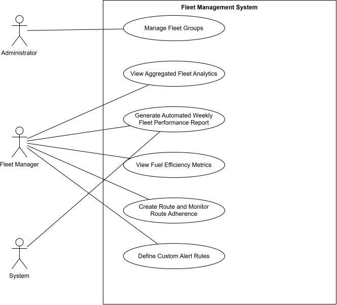

# Use Cases - Fleet Management System

This document derives use cases from the system requirements for the V.A.P.O.R. app, where each use case is a business process that begins with an actor, ends with the actor, and accomplishes a useful task for that actor.

---

## UC01: View Aggregated Fleet Analytics

**Actor:** Fleet Manager

**High-Level Use Case:**
TUCBW the fleet manager navigates to the analytics section of the dashboard. TUCEW the fleet manager sees the aggregated fleet analytics for the selected period and fleet group.

**Description:** A Fleet Manager views aggregated daily and weekly analytics relating to driver behaviour and fleet performance. The system processes recorded telemetry and vehicle events into meaningful fleet-level summaries, allowing the Fleet Manager to identify performance trends and areas requiring attention.

**Pre-conditions:**
- The Fleet Manager is logged in with a valid session.
- The Fleet Manager has access to at least one fleet group.
- Vehicles belonging to the Fleet Manager's assigned fleet group(s) exist.
- Telemetry and/or event data has been recorded for the selected period.

**Main Flow:**
1. Fleet Manager navigates to the analytics section of the dashboard.
2. System retrieves the Fleet Manager's currently assigned fleet group(s).
3. System retrieves the relevant vehicle telemetry, driver behaviour events, and fleet performance data.
4. System aggregates the data according to the selected reporting period.
5. System calculates the relevant fleet-level metrics and summaries.
6. System displays the aggregated analytics using appropriate charts, graphs, tables, and summary cards.
7. Fleet Manager selects either a daily or weekly view.
8. System updates the displayed analytics to reflect the selected period.
9. If the Fleet Manager is assigned to multiple fleet groups, they can select a fleet group and the system updates the analytics accordingly.

**Alternate Flows:**
- **No Data Available:** If there is no data for the selected period, the system displays a clear message indicating that no analytics are available rather than displaying zero or misleading information.
- **Insufficient Data:** If only partial data is available, the system indicates that the analytics are based on incomplete data.
- **Multiple Fleet Groups:** If the Fleet Manager has access to multiple fleet groups, the system allows them to switch between groups and updates the analytics accordingly.
- **Access Changed:** If a Fleet Manager's fleet group assignment changes, the next analytics request checks their current access and excludes any fleet groups they are no longer authorized to view.
- **Data Retrieval Failure:** If the system cannot retrieve the required telemetry or event data, an error message is displayed and the failure is logged.

**Post-conditions:** The Fleet Manager has access to aggregated daily or weekly analytics that accurately represent the driver behaviour and fleet performance data for their authorized fleet group(s). No unauthorized fleet data is included.

---

## UC02: Generate Automated Weekly Fleet Performance Report

**Actor:** System, Fleet Manager

**High-Level Use Case:**
TUCBW the system reaches the scheduled weekly reporting time. TUCEW the fleet manager receives the weekly fleet performance report for their authorized fleet group(s).

**Description:** The system automatically generates a weekly fleet performance report containing aggregated information about driver behaviour and fleet performance for the previous reporting period. The report is delivered to the appropriate Fleet Manager without requiring manual generation.

**Pre-conditions:**
- At least one Fleet Manager account exists.
- Fleet Manager(s) are assigned to one or more fleet groups.
- Vehicle telemetry and event data is available for the reporting period.
- The system's scheduled reporting process is operational.
- A valid notification or delivery method is configured for the Fleet Manager.

**Main Flow:**
1. The system reaches the scheduled weekly reporting time.
2. The system identifies Fleet Managers and their currently assigned fleet group(s).
3. The system determines the previous week's reporting period.
4. The system retrieves the relevant vehicle telemetry, driver behaviour events, and fleet performance data.
5. The system aggregates the data for the reporting period.
6. The system calculates the required fleet performance metrics.
7. The system generates a weekly fleet performance report.
8. The report includes the reporting period, fleet performance metrics, driver behaviour summaries, and relevant trends.
9. The system ensures that only data belonging to the Fleet Manager's authorized fleet group(s) is included.
10. The system delivers the completed report through the configured notification method.
11. The system records the report generation and delivery status.

**Alternate Flows:**
- **No Data Available:** If no relevant data exists for the reporting period, the system generates a report indicating that insufficient data was available.
- **Multiple Fleet Groups:** If a Fleet Manager manages multiple fleet groups, the report includes the appropriate aggregated information for each authorized fleet group.
- **Report Generation Failure:** If the report cannot be generated, the system logs the failure and does not mark the report as successfully generated.
- **Delivery Failure:** If the report is successfully generated but cannot be delivered, the system records the delivery failure for later investigation or retry.
- **Access Change:** If a Fleet Manager's fleet assignment changed during the reporting period, the system applies the current authorization rules when determining what data can be included.

**Post-conditions:** A weekly fleet performance report has been generated and, where successful, delivered to the appropriate Fleet Manager. The report contains aggregated performance information for the authorized fleet group(s), and the generation/delivery status is recorded.

---

## UC03: Manage Fleet Groups

**Actor:** Administrator

**High-Level Use Case:**
TUCBW the administrator selects "Create Fleet Group" (or opens an existing group to edit). TUCEW the administrator sees the fleet group saved with its assigned vehicles and fleet manager(s).

**Description:** An administrator creates and maintains fleet groups, which are the logical groupings of vehicles used to scope data access and reporting for fleet managers. The administrator creates fleet groups, adds or removes vehicles from a group, and assigns one or more fleet managers to a group. A fleet manager's access to analytics, alerts, routes, and vehicle data across the system is determined entirely by the fleet group(s) they are assigned to.

**Pre-conditions:**
- The administrator is logged in with a valid session.
- At least one vehicle and one fleet manager account exist in the system.

**Main Flow:**
1. Administrator navigates to the Fleet Groups management page.
2. System displays a list of existing fleet groups, showing group name, vehicle count, and assigned fleet manager(s).
3. Administrator selects "Create Fleet Group."
4. Administrator enters a group name and an optional description.
5. Administrator adds one or more vehicles to the group from the list of available vehicles.
6. Administrator assigns one or more fleet managers to the group.
7. Administrator saves the fleet group.
8. System validates the configuration and creates the fleet group.
9. System updates each assigned fleet manager's access so they can view and manage only the vehicles within their assigned fleet group(s).
10. Administrator can edit an existing fleet group at any time: add/remove vehicles, add/remove fleet managers, or rename the group.
11. Administrator can deactivate or delete a fleet group.

**Alternate Flows:**
- **Vehicle Already Assigned:** If a selected vehicle already belongs to another fleet group, the system warns the administrator and requires confirmation before moving the vehicle into the new group (a vehicle belongs to at most one fleet group at a time).
- **No Vehicles Selected:** A fleet group can be saved without vehicles; it remains empty until vehicles are added.
- **No Fleet Manager Assigned:** A fleet group can be saved without an assigned fleet manager; it becomes visible/manageable to a fleet manager only once one is assigned.
- **Remove Fleet Manager:** Removing a fleet manager from a group immediately revokes their access to that group's vehicles and data.
- **Remove Vehicle:** Removing a vehicle from a group immediately revokes fleet managers' access to that vehicle's data; the vehicle becomes unassigned.
- **Delete Fleet Group:** Deleting a group unassigns all its vehicles and revokes all fleet managers' access to those vehicles. Historical data already generated remains stored but is no longer accessible through that group.
- **Duplicate Group Name:** If the entered name matches an existing fleet group, the system rejects the save and displays a validation message.

**Post-conditions:** The fleet group and its vehicle/fleet-manager assignments are stored. Each fleet manager's data access (analytics, alerts, routes, fuel efficiency, etc.) reflects only the vehicles within their currently assigned fleet group(s).

### User Story: Manage Fleet Groups

**As an** Administrator
**I want to** create fleet groups, assign vehicles to them, and assign fleet managers to those groups
**So that** each fleet manager only has visibility and control over the vehicles they are responsible for, keeping data and alerts properly scoped across the organization

**Acceptance Criteria:**
- Admin can create a fleet group with a unique name and optional description.
- Admin can add/remove vehicles to/from a fleet group; a vehicle belongs to at most one fleet group at a time.
- Admin can assign/unassign one or more fleet managers to a fleet group.
- Fleet managers only see analytics, alerts, routes, and vehicle data for vehicles within their assigned fleet group(s).
- Removing a vehicle or fleet manager from a group immediately updates access/scope.
- Deleting a fleet group unassigns its vehicles and revokes fleet manager access, but historical data is preserved.
- Duplicate fleet group names are rejected with a validation message.
- The fleet groups list shows group name, vehicle count, and assigned fleet manager(s).

---

## UC04: View Fuel Efficiency Metrics

**Actor:** Fleet Manager

**High-Level Use Case:**
TUCBW the fleet manager clicks the Fuel Efficiency tab on a vehicle's profile page. TUCEW the fleet manager sees the vehicle's fuel efficiency metrics, trend, and fleet ranking for the selected period.

**Description:** A fleet manager views fuel efficiency metrics for a specific vehicle. The system calculates fuel consumption based on distance traveled, road type data from OpenStreetMap, and speed adjustments. Fuel efficiency is displayed in km/L, broken down by road type, with historical trends and fleet comparisons.

**Pre-conditions:**
- The fleet manager is logged in with a valid session.
- The vehicle has completed at least one trip.
- Road data (OpenStreetMap) has been loaded into the roads table.

**Main Flow:**
1. Fleet manager navigates to the Vehicles tab and selects a vehicle.
2. System displays the vehicle's profile page with three tabs: Current Trip, History, and Fuel Efficiency.
3. Fleet manager clicks the Fuel Efficiency tab.
4. System displays the fuel efficiency dashboard with average fuel efficiency (km/L), total distance traveled (km), total fuel consumed (liters), and the number of trips analyzed.
5. System displays a breakdown of fuel efficiency by road type: Motorway (6.0 L/100km), Primary (7.0 L/100km), Residential (10.0 L/100km), Default (8.5 L/100km, for unknown roads).
6. System displays a trend chart showing fuel efficiency over the selected period (7, 30, or 90 days).
7. System displays a ranking table comparing the vehicle's efficiency to other vehicles in the fleet.
8. Fleet manager can filter the data by date range using the date picker.
9. Fleet manager can export the fuel data as a CSV report.
10. Fleet manager closes the tab when done.

**Alternate Flows:**
- **No Fuel Data:** If the vehicle has no completed trips or no fuel data, the system displays an informative empty state explaining that fuel efficiency is calculated after each completed trip, that the data uses distance, road type, and speed, and provides tips for generating data (complete more trips). The empty state also shows the vehicle ID.
- **Limited Road Data:** If a GPS point cannot be matched to a road in the roads table, the system uses the default fuel rate of 8.5 L/100km.

**Post-conditions:** The fleet manager has a complete view of the vehicle's fuel efficiency performance and can identify areas for improvement.

### User Story: View Fuel Efficiency Metrics

**As a** fleet manager
**I want to** view fuel efficiency metrics for each vehicle in my fleet
**So that** I can identify which vehicles are fuel-efficient and which ones are wasting fuel, enabling cost-saving decisions and driver coaching

**Acceptance Criteria:**
- Fleet manager can navigate to a vehicle's profile page and view a "Fuel Efficiency" tab.
- The tab displays the vehicle's average fuel efficiency in km/L.
- The tab displays total distance traveled and total fuel consumed for the selected period.
- The tab shows a breakdown of fuel efficiency by road type (motorway, primary, residential, etc.).
- Fleet manager can filter the fuel data by date range (e.g., last 7, 30, or 90 days).
- A trend chart shows fuel efficiency over time.
- A ranking table compares the vehicle's fuel efficiency against other vehicles in the fleet.
- Fleet manager can export the fuel data as a CSV report.
- If no fuel data exists for the vehicle, an informative empty state explains how data is calculated.
- The empty state shows the vehicle ID and provides tips on completing trips to generate data.

---

## UC05: Create Route and Monitor Route Adherence

**Actor:** Fleet Manager

**High-Level Use Case:**
TUCBW the fleet manager selects "Create Route" on the Routes page. TUCEW the fleet manager has a saved route, with vehicles assigned, that is actively being monitored for adherence.

**Description:** The system allows a Fleet Manager to create a planned driving route by drawing it on the map, assign vehicles to the route, and continuously monitor whether assigned vehicles remain within a configurable deviation distance. When a vehicle deviates from its assigned route, the system generates an alert and records the event for historical reporting.

**Pre-conditions:**
- Fleet Manager is logged in with a valid session.
- Road network has been imported into the system.
- At least one vehicle exists in the system.
- Live vehicle telemetry is being received.

**Main Flow:**
1. Fleet Manager navigates to the Routes page.
2. Fleet Manager selects Create Route.
3. Fleet Manager selects a start location on the map.
4. Fleet Manager selects a destination on the map.
5. The system calculates the shortest valid route using the road network.
6. The calculated route is displayed on the map for review.
7. Fleet Manager enters the route name, an optional description, and the allowed deviation distance.
8. Fleet Manager saves the route.
9. Fleet Manager assigns one or more vehicles to the route.
10. As vehicles transmit GPS positions, the system continuously checks whether they remain within the configured deviation distance of the assigned route.
11. If a vehicle exceeds the allowed deviation distance, the system marks the vehicle as Off Route, records a route deviation event, and generates a notification for the Fleet Manager.
12. When the vehicle returns to the route, the system automatically updates its status back to On Route.

**Alternate Flows:**
- **No Valid Route:** If no valid road route exists between the selected locations, the system informs the Fleet Manager and requests another destination.
- **No Assigned Vehicles:** The route is saved but remains inactive until a vehicle is assigned.
- **Vehicle Removed:** Monitoring stops immediately when a vehicle is unassigned.
- **GPS Signal Lost:** Route monitoring is suspended until telemetry resumes.

**Post-conditions:** The generated route is stored in the system. Vehicle assignments are saved. Route adherence is continuously monitored. Route deviation events are available for historical reporting.

### User Story: Create and Monitor Vehicle Routes

**As a** Fleet Manager
**I want to** create routes, assign vehicles to them, and receive alerts when vehicles deviate from their assigned routes
**So that** I can monitor route compliance and quickly respond when vehicles go off their planned routes

**Acceptance Criteria:**
- Fleet Manager can create a route by drawing it directly on the map.
- Fleet Manager can provide a route name and configure an allowed deviation distance (default: 100 m).
- Fleet Manager can assign one or more vehicles to a route.
- Assigned routes are displayed on the live map.
- The system continuously checks whether assigned vehicles remain within the allowed deviation distance of their assigned route.
- If a vehicle leaves the allowed deviation distance, the system marks the vehicle as Off Route and generates a route deviation alert.
- The alert displays the vehicle ID, assigned route, deviation distance, location, and timestamp.
- Route deviation alerts appear in the dashboard's real-time alert feed.
- Fleet Manager can acknowledge route deviation alerts.
- When the vehicle returns to its assigned route, the system automatically updates its status back to On Route.
- All route deviation events are stored in history for later review.

---

## UC06: Define Custom Alert Rules

**Actor:** Fleet Manager

**High-Level Use Case:**
TUCBW the fleet manager clicks "Create Alert" in the Custom Alerts tab. TUCEW the fleet manager has an active custom alert rule monitoring the vehicles in their selected fleet/group.

**Description:** A fleet manager creates custom alert rules within a dedicated Custom Alerts tab, separate from existing system alerts (geofencing alerts remain in the Geofencing section; general system alerts remain where they are). Supported rule types are: speed threshold, time-based restriction, repeated unsafe event frequency, safety score drop, and trip duration/daily driving hours exceeded. Each custom alert is associated with the fleet/group the manager is responsible for; the system monitors all vehicles belonging to that fleet/group and triggers an alert identifying the specific vehicle when a condition is breached. This gives fleet managers direct control over enforcing operational policy across the fleet they manage, without affecting or being affected by other managers' fleets.

**Pre-conditions:**
- The fleet manager is logged in with a valid session.
- The fleet manager is associated with at least one fleet/group.
- At least one vehicle belongs to that fleet/group.

**Main Flow:**
1. Fleet manager navigates to the Custom Alerts tab.
2. System displays a table of the fleet manager's existing custom alerts, each showing: alert name, condition type, applicable fleet/group, and status (active/inactive).
3. Fleet manager clicks "Create Alert."
4. Fleet manager selects a condition type from the supported list: Speed Threshold, Time-Based Restriction, Repeated Unsafe Events, Safety Score Drop, or Trip Duration Exceeded.
5. Fleet manager configures the parameters specific to the selected condition type (threshold value, time window, event count, etc.).
6. Fleet manager selects the applicable fleet/group from the fleet(s)/group(s) they manage.
7. Fleet manager names the alert and saves it.
8. System validates the alert and begins monitoring all vehicles belonging to the selected fleet/group immediately.
9. When any vehicle within the applicable fleet/group breaches the configured condition, the system triggers the custom alert, identifying the vehicle, the fleet/group, the condition breached, and the timestamp.
10. Fleet manager sees the triggered alert in the Custom Alerts tab in real time.
11. Fleet manager acknowledges the alert.
12. Fleet manager marks the alert as resolved once appropriate action has been taken.

**Alternate Flows:**
- **No Custom Alerts Defined:** If the fleet manager has not created any custom alerts yet, the tab displays an empty state with a prompt to create the first alert.
- **Duplicate Alert Suppression:** If the same alert condition breaches for the same vehicle within a defined debounce window (e.g. 5 minutes), the system generates only a single triggered alert rather than repeated entries.
- **Edit Alert:** Fleet manager can select an existing custom alert, adjust its condition parameters or applicable fleet/group, and save the changes. Changes apply to data received after the save.
- **Deactivate Alert:** Fleet manager can deactivate a custom alert without deleting it; deactivated alerts stop monitoring but remain listed for later reactivation.
- **Delete Alert:** Fleet manager can permanently delete a custom alert. Previously triggered alerts remain in the alert history.
- **Invalid Configuration:** If the fleet manager attempts to save an alert with an invalid or incomplete parameter (e.g. no threshold value, end time before start time, no fleet/group selected), the system rejects the save and displays a validation message.
- **Multiple Alerts Breach Simultaneously:** If a vehicle breaches more than one active custom alert at the same time, each alert triggers independently.
- **Alert Acknowledged but Not Resolved:** A triggered alert can be acknowledged (seen) without being marked resolved, allowing the fleet manager to track alerts still requiring follow-up action.

**Post-conditions:** The custom alert is active and all vehicles within the associated fleet/group are monitored against it going forward. Triggered alerts are deduplicated within the debounce window, displayed in the Custom Alerts tab, and can be acknowledged and resolved by the fleet manager.

### User Story: Define Custom Alert Rules

**As a** Fleet Manager
**I want to** define custom alert rules - based on speed thresholds, time-based restrictions, repeated unsafe event frequency, safety score drops, and trip duration limits - scoped to the fleet/group(s) I manage
**So that** I am notified in real time when a vehicle under my responsibility breaches an operational policy, without affecting or being affected by vehicles belonging to other managers' fleets, and without digging through trip history or analytics to find out after the fact

**Acceptance Criteria:**
- Fleet Manager can create a custom alert by selecting one condition type: Speed Threshold, Time-Based Restriction, Repeated Unsafe Events, Safety Score Drop, or Trip Duration Exceeded.
- Configuration form dynamically shows only the parameters relevant to the selected condition type (e.g. km/h for Speed Threshold, event count + rolling window for Repeated Unsafe Events).
- Alert scope can only be set to a fleet/group the Fleet Manager manages.
- Invalid or incomplete configurations (missing threshold, invalid time range, no fleet/group selected) are rejected with a validation message.
- Saved alerts immediately begin monitoring all vehicles within the selected fleet/group.
- Custom Alerts tab displays a table of the Fleet Manager's own configured rules only, showing name, condition, scope, status, and actions (edit/delete).
- Empty state is shown when no custom alerts have been created yet.
- Existing rules can be edited (pre-filled form) or deleted (with confirmation); deleting a rule stops monitoring but preserves its historical triggered alerts.
- Rules can be deactivated/reactivated via a status toggle without being deleted.
- Triggered alerts identify the vehicle, condition breached, recorded value vs. threshold, and timestamp.
- Repeated breaches of the same rule by the same vehicle within a debounce window (e.g. 5 minutes) generate only one triggered alert, not duplicates.
- A vehicle breaching multiple active rules simultaneously generates a separate alert per rule.
- Alerts only trigger for vehicles within the Fleet Manager's own fleet/group(s) - never for vehicles managed by another Fleet Manager.
- Triggered alerts can be acknowledged in place (no navigation), which updates the "New" count and visually marks the alert as seen.
- Each triggered alert has a "Details" view showing full breach context, GPS location, the originating rule configuration, and a link to the vehicle's profile.
- Alerts can be marked "Resolved" from the Details view, after which they remain visible in the feed in a muted/resolved state rather than being deleted.
- Custom Alerts functionality lives in its own dedicated tab, separate from Geofencing alerts and general system alerts.

---

## Use Case Diagram

Actors: **Administrator**, **Fleet Manager**, and **System** (the scheduled reporting process). Use cases are grouped within the **Fleet Management System** boundary, per the notation covered in class (actor-use case associations only; system boundary contains only use cases and their relationships).

