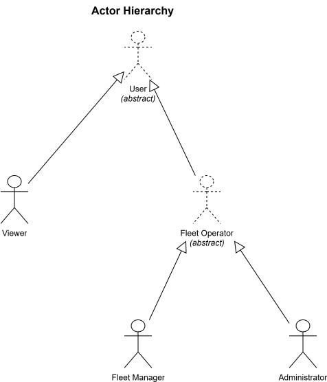
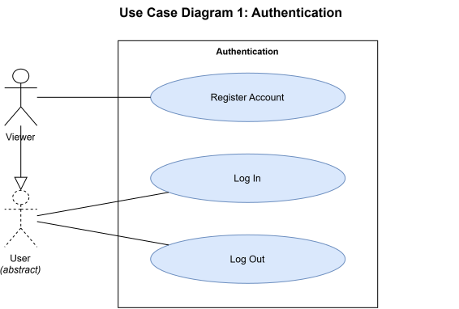
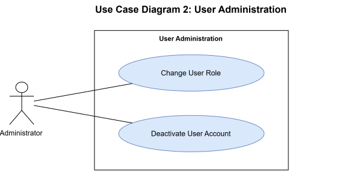
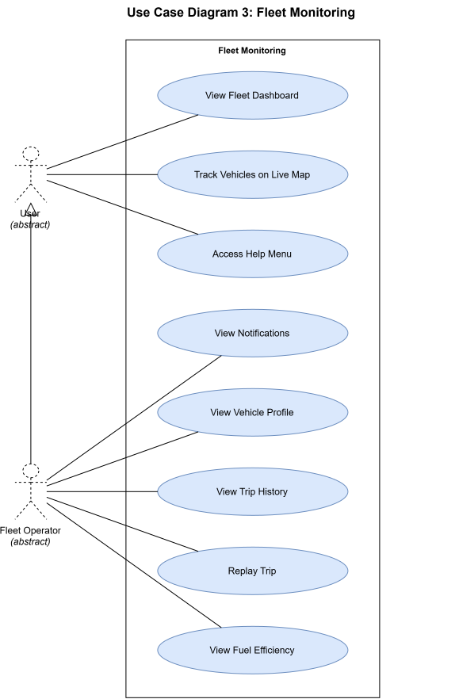
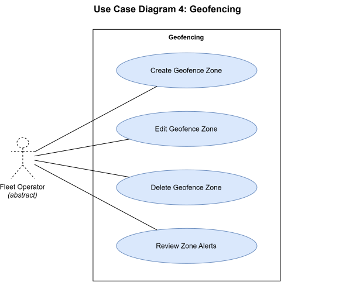
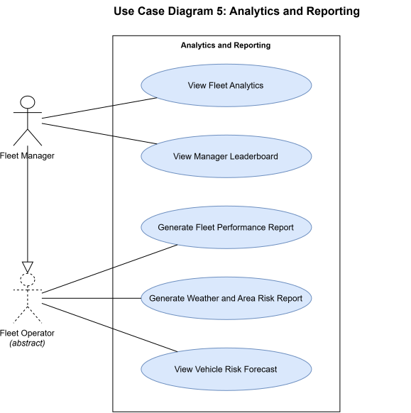
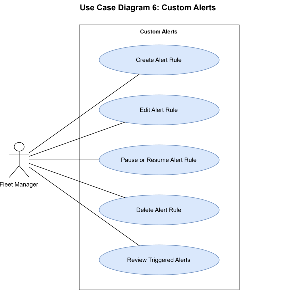
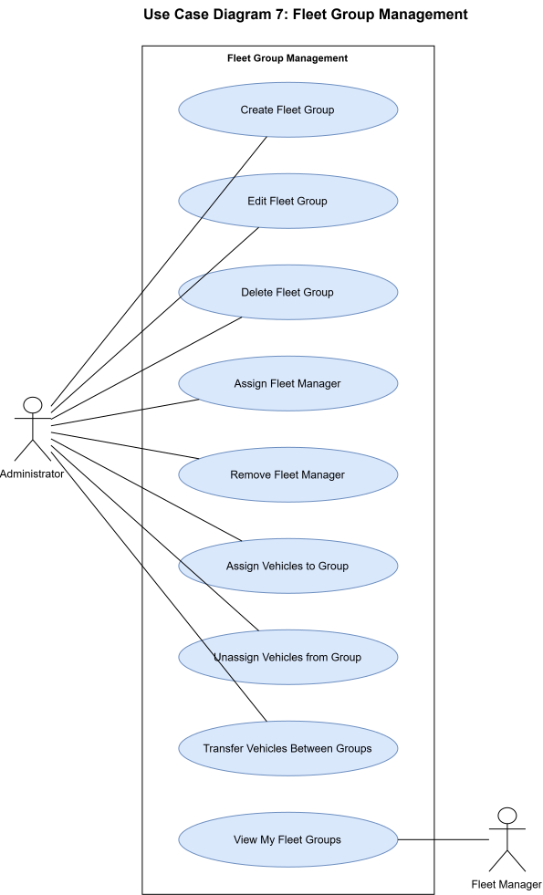

# Demo 4 Functional Requirements, Use cases & User stories

## Functional Requirements

### FR1: Telemetry Data Ingestion & Processing

* **FR1.1:** The system must consume real-time vehicle telemetry data, including GPS coordinates, speed, and driver behavior metrics, directly from an AWS Kinesis stream.
* **FR1.2:** The system must implement data transformation and enrichment pipelines for the raw vehicle data prior to storage.
* **FR1.3:** The system must efficiently store time-series data to facilitate both real-time and historical data access.

### FR2: Real-Time Tracking & Visualization

* **FR2.1:** The system must display the real-time positions of vehicles on an interactive map.
* **FR2.2:** The dashboard must update visualization in near real-time, rendering updates within 5 to 10 seconds of telemetry events.
* **FR2.3:** The system shall display a fleet dashboard showing fleet KPIs, vehicle status and recent activity for the user's role.
* **FR2.4:** The system shall show a vehicle's details when the user selects that vehicle on the live map.
* **FR2.5:** The system shall restrict a Fleet Manager's dashboard figures and live map to vehicles in their assigned fleet groups.

### FR3: Trip Detection & Data Management

* **FR3.1:** The system shall detect the start of a trip when a vehicle's speed rises above 5 km/h following a stationary period, ignition is on and movement is on.
<!-- * **FR3.2:** The system shall detect the end of a trip when vehicle's speed drop below 5 km/h for 10 or more consecutive minutes, the vehicle's ignition is switched off and movement is off all simultaneously
* **FR3.3:** The system shall treat a stationary period (where the ignition is off, movement is off and speed is below 5 km/h) that ends a trip as a rest break for fatigue-detection purposes. -->
* **FR3.4:** The system shall support the detection of multiple distinct trips within a single day of vehicle operation.
* **FR3.5:** The system must store completed trip records for all vehicles managed within the fleet.
* **FR3.6:** The system shall exclude active or currently incomplete trips from any trip history list.
* **FR3.7:** The system must support vehicle groupings using defined fleet or organization tags.

### FR4: Driver Safety Scoring & Behaviour Analytics

* **FR4.1:** The system shall calculate a real-time safety score for an ongoing trip based on the count of `harsh_braking`, `harsh_acceleration`, `harsh_cornering`, and `crash_detection` events recorded since the trip started.
* **FR4.2:** The system shall flag a speeding condition in real time when a vehicle's current speed exceeds a configured threshold.
* **FR4.3:** The system shall calculate a trip safety score for each completed trip based on its recorded unsafe events.
* **FR4.4:** The system shall calculate a vehicle's overall average safety score across all of its recorded trips.
* **FR4.5:** The system must compute a safety score aggregated per day, per vehicle, over a selectable time period.
* **FR4.6:** The system shall provide a "green driving" breakdown per trip showing counts of `harsh_braking`, `harsh_acceleration`, and `harsh_cornering` events.

### FR5: Vehicle Safety Profile

* **FR5.1:** The system must display a list of all registered vehicles, showing vehicle ID, current status, and current safety score.
* **FR5.2:** The system must provide a dedicated vehicle profile page, accessible by selecting a vehicle from the vehicle list.
* **FR5.3:** The vehicle profile page shall provide a "Current Trip" tab, a "History" tab and a "Fuel Efficiency" tab.
* **FR5.4:** The system shall default to the Current Trip tab when a trip is in progress for the vehicle, and to the History tab when the vehicle is currently inactive.
* **FR5.5:** The Current Trip tab shall retrieve live position data for the ongoing trip.
* **FR5.6:** The Current Trip tab shall display current speed, live GPS position on the map, elapsed trip time, a live unsafe-event feed, and the real-time trip safety score.
* **FR5.7:** The History tab shall display a "no trip history available" message when no completed trips exist for the vehicle.
* **FR5.8:** The system shall allow the Fleet Manager to toggle between per-trip and per-day aggregated safety score views on the History tab.

### FR6: Trip History & Route Visualization

* **FR6.1:** The system must retrieve and list all completed trips for a selected vehicle, ordered from most recent to oldest.
* **FR6.2:** Each trip list entry shall display trip date, start time, end time, total distance covered, and trip safety score.
* **FR6.3:** The system must display the vehicle's overall average safety score, calculated across all recorded trips, at the bottom of the trip list.
* **FR6.4:** The system must allow a Fleet Manager to expand a trip to view a detailed, chronological event timeline showing each unsafe event's type, timestamp, and GPS coordinates.
* **FR6.5:** The system must render the full route of selected trip on an interactive map, with event locations marked along the route.

### FR7: Aggregated Fleet Analytics

* **FR7.1:** The system must allow a Fleet Manager to select a daily or weekly period for fleet-wide analytics.
* **FR7.2:** The system must display a fleet-wide safety score trend chart for the selected period.
* **FR7.3:** The system must display a ranked list of vehicles/drivers by safety score, from lowest to highest, for the selected period.
* **FR7.4:** The system shall display a breakdown of total unsafe events by type (`harsh_braking`, `harsh_acceleration`, `harsh_cornering`, `crash_detection`, `speeding`) across the fleet.
* **FR7.5:** The system shall display each vehicle's contribution to the fleet-wide event totals for the selected period.
* **FR7.6:** The system shall allow a Fleet Manager to click on a vehicle in the ranked list to navigate directly to that vehicle's profile page.
* **FR7.7:** The system shall allow a Fleet Manager to view today's fleet safety score broken down by hour.
* **FR7.8:** The system shall restrict fleet analytics to Fleet Managers.

### FR8: Geofence Zone Monitoring

* **FR8.1:** The system shall allow a Fleet Manager to define a named, polygonal geofence zone by drawing a boundary on the interactive map.
* **FR8.2:** The system shall allow a Fleet Manager to configure a zone's trigger type as entry, exit, or both.
* **FR8.3:** The system shall continuously monitor all active vehicles' GPS coordinates, streamed via Kinesis, against all defined geofence zones in real time.
* **FR8.4:** The system shall detect a zone boundary breach using a Lambda function that evaluates vehicle coordinates against the stored zone polygon.
* **FR8.5:** The system shall trigger an alert containing vehicle ID, zone name, breach type (entered/exited), and timestamp when a zone boundary is breached.
* **FR8.6:** The system shall display triggered alerts in the dashboard in real time and allow a Fleet Manager to acknowledge them.
* **FR8.7:** The system shall tally each unsafe event that occurs within a zone's boundary against that zone's event breakdown.
* **FR8.8:** The system shall allow a Fleet Manager to view a per-zone breakdown of unsafe event counts by type.
* **FR8.9:** The system shall allow a Fleet Manager to edit an existing zone's boundary and trigger settings.
* **FR8.10:** The system shall allow a Fleet Manager to delete an existing zone.
* **FR8.11:** The system shall not trigger an entry alert for a vehicle already located inside a zone at the time that zone is created; monitoring shall begin from that point forward.
* **FR8.12:** The system shall not trigger an exit alert for a vehicle located inside a zone at the time that zone is deleted.
* **FR8.13:** The system shall update the map immediately when a zone is created, edited or deleted.
* **FR8.14:** The system shall allow a Fleet Manager to show the location of a zone alert on the map.
* **FR8.15:** The system shall allow a Fleet Manager to clear all zone alerts.

### FR9: Trip Replay & Visualization

* **FR9.1:** The system shall allow a Fleet Manager to initiate an animated replay of a completed trip from the trip history.
* **FR9.2:** The system shall load all `clean_telemetry` position records for the selected trip in chronological order.
* **FR9.3:** The system shall place markers on the route at every location where a `vehicle_events` record exists for that trip.
* **FR9.4:** The system shall animate a vehicle marker moving along the route in sequence, updating the displayed speed and route segment colour at each position.
* **FR9.5:** The system shall display event details in a panel alongside the map when playback reaches an unsafe event marker.
* **FR9.6:** The system shall provide playback controls allowing the Fleet Manager to play, pause, rewind, and scrub to any point in the trip.
* **FR9.7:** The system shall display a static route map, with a message indicating replay is unavailable, when a trip has fewer than the minimum number of telemetry records required for smooth playback.
* **FR9.8:** The system shall display the route without event markers, along with a confirming message, when a trip has no recorded unsafe events.
* **FR9.9:** The system shall allow a Fleet Manager to change the playback speed of a trip replay.

### FR10: Registration & Authentication

* **FR10.1:** The system shall allow a new user to register an account with an email address and password, and shall assign the Viewer role by default.
* **FR10.2:** The system shall validate all required registration fields before creating the account.
* **FR10.3:** The system shall reject a registration when the email address is already registered.
* **FR10.4:** The system shall require a newly registered user to verify their email address.
* **FR10.5:** The system shall authenticate a user with their email and password through AWS Cognito.
* **FR10.6:** The system shall extract the user's role from the authentication token and display the dashboard for that role after a successful login.
* **FR10.7:** The system shall refuse a login with incorrect credentials and display an error.
* **FR10.8:** The system shall refuse a login for a deactivated account and display an error.
* **FR10.9:** The system shall allow a user to log out and shall return them to the login page.
* **FR10.10:** The system shall not allow an unauthenticated user to access any page other than the login and registration pages.

### FR11: User & Role Administration

* **FR11.1:** The system shall allow an Administrator to view a list of users showing each user's role and account status.
* **FR11.2:** The system shall allow an Administrator to change a user's role.
* **FR11.3:** The system shall apply a role change on the affected user's next request.
* **FR11.4:** The system shall allow an Administrator to deactivate a user account.
* **FR11.5:** The system shall not allow a deactivated user to sign in.
* **FR11.6:** The system shall not allow an Administrator to change their own role.
* **FR11.7:** The system shall not allow an Administrator to deactivate their own account.
* **FR11.8:** The system shall restrict user and role administration to Administrators.
* **FR11.9:** The system shall limit Viewers to read-only access to the dashboard and live map.

### FR12: Custom Alert Rules

* **FR12.1:** The system shall allow a Fleet Manager to create a custom alert rule of type speeding, restricted hours, repeated unsafe events, safety score drop or long trip.
* **FR12.2:** The system shall allow a Fleet Manager to edit an existing alert rule.
* **FR12.3:** The system shall show a preview estimating how often a rule would have fired over the last 30 days before the rule is created or saved after editing.
* **FR12.4:** The system shall allow a Fleet Manager to pause and resume an alert rule.
* **FR12.5:** The system shall not trigger a paused alert rule until it is resumed.
* **FR12.6:** The system shall allow a Fleet Manager to delete an alert rule.
* **FR12.7:** The system shall evaluate all active alert rules against the telemetry of the vehicles in the Fleet Manager's groups.
* **FR12.8:** The system shall create a triggered alert when a vehicle meets the conditions of an active rule.
* **FR12.9:** The system shall not trigger a safety score alert more than once per vehicle per rule within 24 hours.
* **FR12.10:** The system shall list triggered alerts and allow a Fleet Manager to filter them by status.
* **FR12.11:** The system shall allow a Fleet Manager to acknowledge and resolve each triggered alert.
* **FR12.12:** The system shall not evaluate a deleted alert rule.
* **FR12.13:** The system shall restrict custom alert rules and triggered alerts to Fleet Managers.

### FR13: Fleet Group Management

* **FR13.1:** The system shall allow an Administrator to create a fleet group with a name and description.
* **FR13.2:** The system shall reject a fleet group name that matches an existing active group.
* **FR13.3:** The system shall allow an Administrator to edit a fleet group's name and description.
* **FR13.4:** The system shall allow an Administrator to delete a fleet group after confirming the action.
* **FR13.5:** The system shall unassign a group's vehicles and remove its manager when the group is deleted.
* **FR13.6:** The system shall allow an Administrator to assign a Fleet Manager to a group.
* **FR13.7:** The system shall allow a group to have at most one Fleet Manager.
* **FR13.8:** The system shall only allow active Fleet Managers to be assigned to a group.
* **FR13.9:** The system shall allow an Administrator to remove a group's Fleet Manager and shall mark the group as unassigned.
* **FR13.10:** The system shall record every Fleet Manager assignment and removal in an audit log.
* **FR13.11:** The system shall allow an Administrator to assign vehicles to a group from the "Unassigned" and "In Another Group" lists.
* **FR13.12:** The system shall allow an Administrator to unassign vehicles from a group.
* **FR13.13:** The system shall allow an Administrator to select vehicles by checkbox or by clicking their row.
* **FR13.14:** The system shall allow an Administrator to transfer selected vehicles to a target group after confirming the action.
* **FR13.15:** The system shall report which vehicles were transferred once a transfer completes.
* **FR13.16:** The system shall skip any vehicle that left the source group before a transfer completes and shall report it as skipped.
* **FR13.17:** The system shall display a card for each fleet group a Fleet Manager manages on the Vehicles page.
* **FR13.18:** The system shall limit a Fleet Manager's access to vehicles in their assigned groups.
* **FR13.19:** The system shall remove a Fleet Manager's access to a group's vehicles on their next request after they are removed from that group.
* **FR13.20:** The system shall give Administrators access to the entire fleet.

### FR14: Reports

* **FR14.1:** The system shall allow a Fleet Manager or Administrator to generate a fleet performance report for their fleet, one group or one vehicle.
* **FR14.2:** The system shall allow a Fleet Manager or Administrator to generate the performance report for the last complete week or the last complete month.
* **FR14.3:** The system shall allow a Fleet Manager or Administrator to compare selected vehicles side by side in the performance report.
* **FR14.4:** The system shall allow a Fleet Manager or Administrator to export the performance report as a CSV file.
* **FR14.5:** The system shall allow a Fleet Manager or Administrator to generate a weather and area risk report for their fleet, one group or one vehicle over a period of 1 to 7 days.
* **FR14.6:** The system shall compare wet and dry unsafe event rates per 100 km in the weather and area risk report.
* **FR14.7:** The system shall mark each area and vehicle in the weather and area risk report as "Above fleet", "Below fleet" or "Insufficient data".
* **FR14.8:** The system shall mark an area or vehicle as "Insufficient data" when it has too little recorded distance for a reliable event rate.
* **FR14.9:** The system shall limit a Fleet Manager's reports to vehicles in their assigned groups.
* **FR14.10:** The system shall display a message stating that no data is available when a report has no completed trips in the selected period.

### FR15: Risk Forecasting & Leaderboard

* **FR15.1:** The system shall display a predicted risk tier for each vehicle, based on the last 30 days of recorded trips.
* **FR15.2:** The system shall allow a Fleet Manager or Administrator to filter and sort vehicles by predicted risk tier.
* **FR15.3:** The system shall display a vehicle's coaching history in its risk details.
* **FR15.4:** The system shall display similar vehicles in a vehicle's risk details.
* **FR15.5:** The system shall display "Insufficient data" instead of a risk tier for a vehicle with no recorded trips in the last 30 days.
* **FR15.6:** The system shall display a manager leaderboard ranking Fleet Managers by the average safety score of their vehicles over the last 7 days.
* **FR15.7:** The system shall display the top 5 managers on the leaderboard by default.
* **FR15.8:** The system shall exclude a manager whose vehicles have no recorded trips in the last 7 days from the leaderboard ranking.
* **FR15.9:** The system shall restrict the manager leaderboard to Fleet Managers.

### FR16: Fuel Efficiency

* **FR16.1:** The system shall display an efficiency score for a vehicle on its Fuel Efficiency tab.
* **FR16.2:** The system shall display a vehicle's carbon impact on its Fuel Efficiency tab.
* **FR16.3:** The system shall display a vehicle's potential fuel savings on its Fuel Efficiency tab.
* **FR16.4:** The system shall display a vehicle's fuel use broken down by road type.
* **FR16.5:** The system shall display a vehicle's fuel use broken down by trip.
* **FR16.6:** The system shall display a "no fuel data available" message when a vehicle has no completed trips.

### FR17: Help & Notifications

* **FR17.1:** The system shall provide a help menu that opens from the header on every page.
* **FR17.2:** The system shall allow a user to search the help articles.
* **FR17.3:** The system shall provide a notification bell that lists a Fleet Manager's or Administrator's notifications.
* **FR17.4:** The system shall notify a Fleet Manager when they are assigned to or removed from a fleet group.
* **FR17.5:** The system shall notify an Administrator of fleet groups that have no manager.
* **FR17.6:** The system shall notify an Administrator of vehicles that are not assigned to a group.
* **FR17.7:** The system shall remove a coverage-gap notification once the gap is resolved.

---
# User Stories and Use Cases
 
This section of the document contains sections **3.1.2 User Stories / User Characteristics** and **3.1.3 Use Cases** of the SRS.
 
---
 
# 3.1.2 User Stories / User Characteristics
 
V.A.P.O.R. has three types of users. Each section describes the user, then lists their user stories. Every story has short, testable acceptance criteria links to the use cases (**UC**) in 3.1.3.

 
## 3.1.2.2 Stories Shared by All Users

These stories apply to all three user types.

| ID | User story | Acceptance criteria | UC |
|---|---|---|---|
| US02 | As a user, I want to log in and out securely so that only I can access my account. | • With correct credentials, I see the dashboard for my role. • Incorrect credentials or a deactivated account are refused with an error. • When I log out, I return to the login page. | UC02, UC03 |
| US03 | As a user, I want a fleet dashboard so that I can see the state of the fleet at a glance. | • The dashboard shows fleet KPIs, vehicle status and recent activity for my role. • A Fleet Manager's figures include only vehicles in their groups. | UC06 |
| US04 | As a user, I want to see vehicles on a live map so that I know where they are right now. | • Vehicle positions refresh every few seconds without reloading the page. • Clicking a vehicle shows its details. | UC07 |
| US05 | As a user, I want an in-app help menu so that I can learn a feature without leaving the platform. | • The help menu opens from the header on every page. • I can search the help articles. | UC08 |

## 3.1.2.3 Fleet Manager

**Profile:** The primary, day-to-day user. Responsible for the vehicles and drivers in the fleet groups an Administrator has assigned to them. Monitors live operations, investigates unsafe driving and decides which drivers need coaching.

**Technical proficiency:** Moderate. Familiar with dashboards, maps and filtering data, but not with databases or telematics hardware.

**Primary goals:** Spot unsafe driving early, respond to alerts quickly, and improve their fleet's safety score over time.

**Scope:** A Fleet Manager only sees vehicles in their own fleet groups.

| ID | User story | Acceptance criteria | UC |
|---|---|---|---|
| US06 | As a fleet manager, I want a profile for each vehicle so that I can check its current trip and safety record in one place. | • The profile has Current Trip, History and Fuel Efficiency tabs. • If a trip is in progress, Current Trip shows its live safety score and unsafe events. | UC10 |
| US07 | As a fleet manager, I want to see a vehicle's trip history so that I can investigate past trips and incidents. | • Completed trips are listed with their safety scores, and the vehicle's overall score is shown. • Expanding a trip shows its event timeline and route on a map. | UC11 |
| US08 | As a fleet manager, I want to replay a completed trip so that I can see exactly how and where unsafe events happened. | • I can play, pause and rewind the replay, change its speed, and jump to any point. | UC12 |
| US09 | As a fleet manager, I want to see a vehicle's fuel efficiency so that I can find where fuel is being wasted. | • The tab shows an efficiency score, carbon impact and potential savings. • Fuel use is broken down by road type and by trip. | UC13 |
| US10 | As a fleet manager, I want to create, edit and delete geofence zones so that I am alerted when vehicles enter or leave important areas. | • I can draw a named zone on the map and choose entry, exit or both. • Edited or deleted zones update on the map immediately. | UC14, UC15, UC16 |
| US11 | As a fleet manager, I want to review zone alerts so that I know which vehicles crossed a zone boundary and when. | • Each alert shows the vehicle, zone, entry or exit, and the time. • I can show an alert's location on the map. • I can clear all alerts. | UC17 |
| US12 | As a fleet manager, I want to see fleet analytics on my dashboard so that I can follow my fleet's safety score over time. | • I can view today's safety score by hour, or the trend over the week. | UC18 |
| US13 | As a fleet manager, I want a manager leaderboard so that good driving is recognised and I am motivated to improve my fleet. | • Managers are ranked by their vehicles' average safety score over the last 7 days. • The top 5 are shown by default. | UC19 |
| US14 | As a fleet manager, I want a fleet performance report so that I can compare how safely my vehicles drive. | • I can report on my fleet, one group or one vehicle, for the last complete week or month. • I can compare selected vehicles side by side. • I can export the report as CSV. | UC20 |
| US15 | As a fleet manager, I want a weather and area risk report so that I can see whether rain or specific areas increase unsafe driving. | • I can report on my fleet, a group or one vehicle, for 1 to 7 days. • The report compares wet and dry event rates per 100 km. • Areas and vehicles are marked Above fleet, Below fleet or Insufficient data. | UC21 |
| US16 | As a fleet manager, I want a risk forecast for each vehicle so that I can coach drivers before an incident happens. | • Each vehicle shows a predicted risk tier, based on the last 30 days, and I can filter and sort by it. • A vehicle's details show its coaching history and similar vehicles. | UC22 |
| US17 | As a fleet manager, I want to create, edit, pause and delete custom alert rules so that I am notified about the behaviour that matters to my fleet. | • I can create rules for speeding, restricted hours, repeated unsafe events, safety score drops and long trips. • Before saving, a preview estimates how often the rule would have fired in the last 30 days. • A paused rule stops triggering until I resume it. | UC23, UC24, UC25, UC26 |
| US18 | As a fleet manager, I want to review triggered alerts so that I can act on them and track what has been handled. | • I can acknowledge and resolve each alert, and filter alerts by status. • A safety score alert fires at most once per vehicle per rule every 24 hours. | UC27 |
| US19 | As a fleet manager, I want to be notified when I am given or removed from a fleet group so that I know which vehicles I am responsible for. | • The notification bell shows each group assignment and removal. | UC09 |
| US20 | As a fleet manager, I want to see only my fleet groups and their vehicles so that I can focus on my responsibilities. | • The Vehicles page shows a card for each group I manage. • If I am removed from a group, I lose access to its vehicles on my next request. | UC36 |

## 3.1.2.4 Administrator

**Profile:** Manages the platform and how the fleet is organised. Sets up user roles, divides vehicles into fleet groups, and decides which manager is responsible for each group.

**Technical proficiency:** High. Comfortable with configuration, permissions and system-wide settings.

**Primary goals:** Make sure every vehicle is managed by the right person, every user has the right access, and changes are traceable.

**Scope:** Administrators see the entire fleet. They also have stories **US06-US11** and **US14-US16**. Fleet analytics, the leaderboard and custom alerts are for Fleet Managers only.

| ID | User story | Acceptance criteria | UC |
|---|---|---|---|
| US21 | As an administrator, I want to change user roles and deactivate accounts so that access matches each person's responsibilities. | • A role change takes effect on the user's next request. • A deactivated user can no longer sign in. • I cannot change my own role or deactivate my own account. | UC04, UC05 |
| US22 | As an administrator, I want to create, edit and delete fleet groups so that vehicles are organised into manageable units. | • Group names are unique among active groups. • Deleting a group unassigns its vehicles and removes its manager, after I confirm. | UC28, UC29, UC30 |
| US23 | As an administrator, I want to assign and remove a group's fleet manager so that someone is accountable for every group. | • A group has at most one manager. • Only active fleet managers can be assigned. • Every change is recorded in the audit log. | UC31, UC32 |
| US24 | As an administrator, I want to assign, unassign and transfer vehicles between groups so that each vehicle is managed by the right person. | • I can select vehicles by checkbox or by clicking their row. • A transfer asks me to confirm, then reports which vehicles moved. • Vehicles that left the group in the meantime are skipped and reported. | UC33, UC34, UC35 |
| US25 | As an administrator, I want to be notified about gaps in fleet coverage so that no vehicle or group is left unmanaged. | • The notification bell lists groups with no manager and vehicles with no group. | UC09 |

---

# 3.1.3 Use Cases

Use cases are derived from the functional requirements and verified against the use case definition: each is a **business process** that **begins with an actor**, **ends with the actor**, and **accomplishes a useful task for that actor**. Steps and background processing are not use cases and are left to the design models.

## Actors

| Actor | Description |
|---|---|
| Viewer | User type with read-only access to the dashboard and live map. |
| Fleet Manager | User type responsible for their assigned fleet groups. |
| Administrator | User type who manages users and fleet groups, and sees the entire fleet. |
| User *(abstract)* | Not a user type. Groups all three user types, for use cases every user can perform. |
| Fleet Operator *(abstract)* | Not a user type. Groups Fleet Manager and Administrator, for monitoring and analysis use cases they share. |

The two abstract actors only exist to keep the diagrams simple through actor inheritance: a Fleet Manager **is a** Fleet Operator, so it can perform every use case linked to Fleet Operator.

## Use Case Identification

| Use case | Business process? | Begins with actor? | Ends with actor? | Useful task? | Actor | User stories |
|---|---|---|---|---|---|---|
| UC01 Register Account | Y | Y | Y | Y | Viewer | US01 |
| UC02 Log In | Y | Y | Y | Y | User | US02 |
| UC03 Log Out | Y | Y | Y | Y | User | US02 |
| UC04 Change User Role | Y | Y | Y | Y | Administrator | US21 |
| UC05 Deactivate User Account | Y | Y | Y | Y | Administrator | US21 |
| UC06 View Fleet Dashboard | Y | Y | Y | Y | User | US03 |
| UC07 Track Vehicles on Live Map | Y | Y | Y | Y | User | US04 |
| UC08 Access Help Menu | Y | Y | Y | Y | User | US05 |
| UC09 View Notifications | Y | Y | Y | Y | Fleet Operator | US19, US25 |
| UC10 View Vehicle Profile | Y | Y | Y | Y | Fleet Operator | US06 |
| UC11 View Trip History | Y | Y | Y | Y | Fleet Operator | US07 |
| UC12 Replay Trip | Y | Y | Y | Y | Fleet Operator | US08 |
| UC13 View Fuel Efficiency | Y | Y | Y | Y | Fleet Operator | US09 |
| UC14 Create Geofence Zone | Y | Y | Y | Y | Fleet Operator | US10 |
| UC15 Edit Geofence Zone | Y | Y | Y | Y | Fleet Operator | US10 |
| UC16 Delete Geofence Zone | Y | Y | Y | Y | Fleet Operator | US10 |
| UC17 Review Zone Alerts | Y | Y | Y | Y | Fleet Operator | US11 |
| UC18 View Fleet Analytics | Y | Y | Y | Y | Fleet Manager | US12 |
| UC19 View Manager Leaderboard | Y | Y | Y | Y | Fleet Manager | US13 |
| UC20 Generate Fleet Performance Report | Y | Y | Y | Y | Fleet Operator | US14 |
| UC21 Generate Weather and Area Risk Report | Y | Y | Y | Y | Fleet Operator | US15 |
| UC22 View Vehicle Risk Forecast | Y | Y | Y | Y | Fleet Operator | US16 |
| UC23 Create Alert Rule | Y | Y | Y | Y | Fleet Manager | US17 |
| UC24 Edit Alert Rule | Y | Y | Y | Y | Fleet Manager | US17 |
| UC25 Pause or Resume Alert Rule | Y | Y | Y | Y | Fleet Manager | US17 |
| UC26 Delete Alert Rule | Y | Y | Y | Y | Fleet Manager | US17 |
| UC27 Review Triggered Alerts | Y | Y | Y | Y | Fleet Manager | US18 |
| UC28 Create Fleet Group | Y | Y | Y | Y | Administrator | US22 |
| UC29 Edit Fleet Group | Y | Y | Y | Y | Administrator | US22 |
| UC30 Delete Fleet Group | Y | Y | Y | Y | Administrator | US22 |
| UC31 Assign Fleet Manager | Y | Y | Y | Y | Administrator | US23 |
| UC32 Remove Fleet Manager | Y | Y | Y | Y | Administrator | US23 |
| UC33 Assign Vehicles to Group | Y | Y | Y | Y | Administrator | US24 |
| UC34 Unassign Vehicles from Group | Y | Y | Y | Y | Administrator | US24 |
| UC35 Transfer Vehicles Between Groups | Y | Y | Y | Y | Administrator | US24 |
| UC36 View My Fleet Groups | Y | Y | Y | Y | Fleet Manager | US20 |

## Use Case Diagram 1: Authentication

| UC | Use case | TUCBW | TUCEW |
|---|---|---|---|
| UC01 | Register Account | a new Viewer clicks **Create one** on the login page. | the Viewer is asked to verify their email address. |
| UC02 | Log In | the User submits their email and password. | the User sees the dashboard for their role. |
| UC03 | Log Out | the User clicks the log out button in the sidebar. | the User sees the login page. |

## Use Case Diagram 2: User Administration

| UC | Use case | TUCBW | TUCEW |
|---|---|---|---|
| UC04 | Change User Role | the Administrator selects a new role for a user on the admin dashboard. | the Administrator sees the user listed with the new role. |
| UC05 | Deactivate User Account | the Administrator chooses to deactivate a user. | the Administrator sees the user marked as deactivated. |

## Use Case Diagram 3: Fleet Monitoring

| UC | Use case | TUCBW | TUCEW |
|---|---|---|---|
| UC06 | View Fleet Dashboard | the User opens **Dashboard**. | the User sees the fleet's KPIs, alerts and activity. |
| UC07 | Track Vehicles on Live Map | the User opens **Live Map**. | the User sees the current positions of their vehicles. |
| UC08 | Access Help Menu | the User clicks the help icon in the header. | the User reads the help article they need. |
| UC09 | View Notifications | the Fleet Operator clicks the notification bell. | the Fleet Operator has read their notifications. |
| UC10 | View Vehicle Profile | the Fleet Operator selects a vehicle under **Vehicles**. | the Fleet Operator sees the vehicle's current trip and safety record. |
| UC11 | View Trip History | the Fleet Operator opens a vehicle's **History** tab. | the Fleet Operator sees the vehicle's past trips, events and routes. |
| UC12 | Replay Trip | the Fleet Operator chooses to replay a completed trip. | the Fleet Operator has watched the trip replayed on the map. |
| UC13 | View Fuel Efficiency | the Fleet Operator opens a vehicle's **Fuel Efficiency** tab. | the Fleet Operator sees the vehicle's efficiency score, savings and breakdown. |

## Use Case Diagram 4: Geofencing

| UC | Use case | TUCBW | TUCEW |
|---|---|---|---|
| UC14 | Create Geofence Zone | the Fleet Operator starts drawing a zone under **Geofence**. | the Fleet Operator sees the new zone on the map. |
| UC15 | Edit Geofence Zone | the Fleet Operator selects an existing zone to edit. | the Fleet Operator sees the updated zone. |
| UC16 | Delete Geofence Zone | the Fleet Operator chooses to delete a zone. | the zone no longer appears on the map. |
| UC17 | Review Zone Alerts | the Fleet Operator opens the zone alerts list. | the Fleet Operator knows which vehicles entered or left each zone, and when. |

## Use Case Diagram 5: Analytics and Reporting

| UC | Use case | TUCBW | TUCEW |
|---|---|---|---|
| UC18 | View Fleet Analytics | the Fleet Manager chooses **today** or **week** in Fleet Analytics on their dashboard. | the Fleet Manager sees the fleet safety score trend for that period. |
| UC19 | View Manager Leaderboard | the Fleet Manager opens the leaderboard on their dashboard. | the Fleet Manager sees managers ranked by recent safety score. |
| UC20 | Generate Fleet Performance Report | the Fleet Operator chooses a scope and period under **Reports**. | the Fleet Operator sees, and optionally exports, the performance report. |
| UC21 | Generate Weather and Area Risk Report | the Fleet Operator opens the **Weather and areas** tab and chooses a scope and period. | the Fleet Operator sees event rates by weather and area, with risk verdicts. |
| UC22 | View Vehicle Risk Forecast | the Fleet Operator opens **Fleet Risk**. | the Fleet Operator sees each vehicle's predicted risk and coaching history. |

## Use Case Diagram 6: Custom Alerts

| UC | Use case | TUCBW | TUCEW |
|---|---|---|---|
| UC23 | Create Alert Rule | the Fleet Manager clicks **Create Alert Rules** under **Custom Alerts**. | the Fleet Manager sees the new rule in their rule list. |
| UC24 | Edit Alert Rule | the Fleet Manager clicks the edit icon on a rule. | the Fleet Manager sees the rule with its new settings. |
| UC25 | Pause or Resume Alert Rule | the Fleet Manager changes a rule's status. | the Fleet Manager sees the rule marked as paused or active. |
| UC26 | Delete Alert Rule | the Fleet Manager clicks the delete icon on a rule. | the rule no longer appears in the rule list. |
| UC27 | Review Triggered Alerts | the Fleet Manager opens the triggered alerts list. | the Fleet Manager has acknowledged or resolved the alerts they reviewed. |

## Use Case Diagram 7: Fleet Group Management

| UC | Use case | TUCBW | TUCEW |
|---|---|---|---|
| UC28 | Create Fleet Group | the Administrator clicks **Create Group** under **FleetGroups**. | the Administrator sees the new group in the list. |
| UC29 | Edit Fleet Group | the Administrator clicks the edit icon on a group. | the Administrator sees the group's new name and description. |
| UC30 | Delete Fleet Group | the Administrator clicks **Delete Group**. | the group no longer appears in the list. |
| UC31 | Assign Fleet Manager | the Administrator selects a manager on a group's page. | the Administrator sees the manager assigned to the group. |
| UC32 | Remove Fleet Manager | the Administrator clicks remove next to the group's manager. | the Administrator sees the group marked as unassigned. |
| UC33 | Assign Vehicles to Group | the Administrator selects vehicles on the **Unassigned** or **In Another Group** tab. | the Administrator sees the vehicles listed under **In This Group**. |
| UC34 | Unassign Vehicles from Group | the Administrator selects vehicles on the **In This Group** tab. | the Administrator sees the vehicles listed under **Unassigned**. |
| UC35 | Transfer Vehicles Between Groups | the Administrator selects vehicles and a target group from **Transfer to...** | the Administrator sees a confirmation that the vehicles moved to the target group. |
| UC36 | View My Fleet Groups | the Fleet Manager opens **Vehicles**. | the Fleet Manager sees a card for each group they manage. |

## Requirements-Use Case Traceability Matrix

**FR key:** FR1 Telemetry ingestion · FR2 Real-time tracking · FR3 Trip detection and vehicle grouping · FR4 Safety scoring · FR5 Vehicle profile · FR6 Trip history · FR7 Fleet analytics · FR8 Geofencing · FR9 Trip replay · FR10 Registration and login · FR11 User and role administration · FR12 Custom alert rules · FR13 Fleet group management · FR14 Reports · FR15 Risk forecasting and leaderboard · FR16 Fuel efficiency · FR17 Help and notifications

An **X** means the use case satisfies part of that functional requirement. Rows are use cases and columns are requirements, so the table fits on the page.

| UC | FR1 | FR2 | FR3 | FR4 | FR5 | FR6 | FR7 | FR8 | FR9 | FR10 | FR11 | FR12 | FR13 | FR14 | FR15 | FR16 | FR17 |
|---|---|---|---|---|---|---|---|---|---|---|---|---|---|---|---|---|---|
| UC01 | | | | | | | | | | X | | | | | | | |
| UC02 | | | | | | | | | | X | | | | | | | |
| UC03 | | | | | | | | | | X | | | | | | | |
| UC04 | | | | | | | | | | | X | | | | | | |
| UC05 | | | | | | | | | | | X | | | | | | |
| UC06 | X | X | | X | | | | | | | | | | | | | |
| UC07 | X | X | | | | | | | | | | | | | | | |
| UC08 | | | | | | | | | | | | | | | | | X |
| UC09 | | | | | | | | | | | | | X | | | | X |
| UC10 | | | | X | X | | | | | | | | | | | | |
| UC11 | | | X | X | | X | | | | | | | | | | | |
| UC12 | | | | | | | | | X | | | | | | | | |
| UC13 | | | | | | | | | | | | | | | | X | |
| UC14 | | | | | | | | X | | | | | | | | | |
| UC15 | | | | | | | | X | | | | | | | | | |
| UC16 | | | | | | | | X | | | | | | | | | |
| UC17 | | | | | | | | X | | | | | | | | | |
| UC18 | | | | X | | | X | | | | | | | | | | |
| UC19 | | | | X | | | | | | | | | | | X | | |
| UC20 | | | | X | | | | | | | | | | X | | | |
| UC21 | | | | | | | | | | | | | | X | | | |
| UC22 | | | | | | | | | | | | | | | X | | |
| UC23 | | | | | | | | | | | | X | | | | | |
| UC24 | | | | | | | | | | | | X | | | | | |
| UC25 | | | | | | | | | | | | X | | | | | |
| UC26 | | | | | | | | | | | | X | | | | | |
| UC27 | | | | | | | | | | | | X | | | | | |
| UC28 | | | X | | | | | | | | | | X | | | | |
| UC29 | | | | | | | | | | | | | X | | | | |
| UC30 | | | | | | | | | | | | | X | | | | |
| UC31 | | | | | | | | | | | | | X | | | | |
| UC32 | | | | | | | | | | | | | X | | | | |
| UC33 | | | X | | | | | | | | | | X | | | | |
| UC34 | | | | | | | | | | | | | X | | | | |
| UC35 | | | | | | | | | | | | | X | | | | |
| UC36 | | | | | | | | | | | | | X | | | | |
