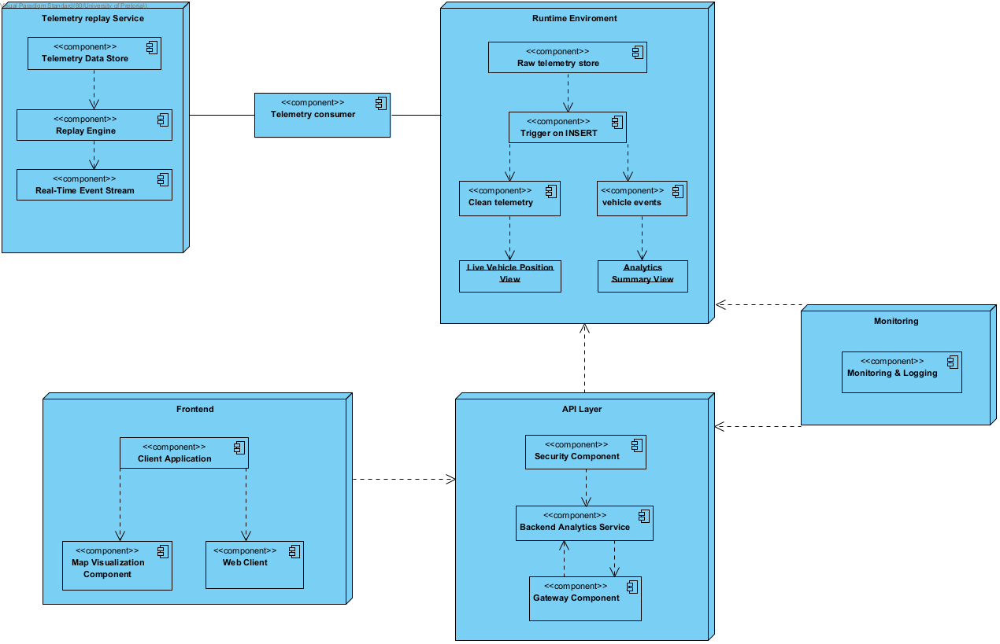

# System Architecture

## Contents
1 Overall software architecture
1.1 Architectural quality requirements ..................................
1.1.1 Flexibility .............................
1.1.2 Maintainability .........................
1.1.3 Scalability .............................
1.1.4 Performance .............................
1.1.5 Reliability .............................
1.1.6 Security ................................
1.1.7 Auditability ............................
1.1.8 Testability .............................
1.1.9 Usability ...............................
1.1.10 Integrability ..........................
1.2 Architectural responsibility ................................
1.3 Architecture Constraints ...................................

2 Architectural Component: Data Pipeline & Storage
2.1 Quality Requirements ...................................
2.2 Architectural Responsibilities ...............................
2.3 Frameworks and Technologies ...................................
2.4 Architectural Realization Mapping ................................
2.5 Technology Choice .........................................

3 Technology-Neutral Architecture Diagram

4 Architecture Patterns

## Overview
The Vehicle Analytics Platform is designed as a serverless, event-driven fleet telematics system. It ingests frequent vehicle telemetry, processes it in near real time, stores it in a time-series optimized database, and exposes aggregated insights through a secured API and dashboard.

## 1. Overall Quality Requirements

### 1.1.3 Scalability

The current scaling targets are:
- Minimum 15 concurrent vehicles tracked
- 160 telemetry records per minute at steady state, based on 15 vehicles sending records every 5 seconds
- PgBouncer supporting up to 100 client connections
- 80 real database connections available behind the pool
- TimescaleDB handling millions of rows efficiently through hypertables and partition-aware storage

### 1.1.4 Performance

- API response time below 500ms, validated through CloudWatch
- Telemetry processed below 2 seconds, measured using iterator age
- Database query for dashboard reads, are pre-computation
- Map updates appearing within 5 to 10 seconds of vehicle transmission

### 1.1.5 Reliability

- Lambda auto-restarts on failure
- PgBouncer maintaining connection pool stability under burst traffic
- TimescaleDB continuous aggregates refreshing automatically
- ON CONFLICT DO NOTHING preventing duplicate Kinesis records from creating duplicate rows
- CloudWatch logs detecting service and pipeline failures

### 1.1.6 Security

- JWT authentication via Cognito on all protected endpoints
- API Gateway Cognito authorizer at the edge
- pg_hba.conf restricting direct database access
- TLS on all network connections
- Least privilege database access through the fleet_admin role

### 1.1.7 Auditability

- CloudWatch logs all Lambda invocations
- PostgreSQL logs all queries
- Kinesis records are retained for 24 hours
- CloudWatch metrics track pipeline activity across ingestion, processing, and storage

### 1.1.8 Testability

- Jest unit tests cover database migrations
- GitHub Actions runs CI on every pull request to develop and main
- Codecov tracks coverage over time
- Manual integration tests can be performed with curl against the deployed API

## 2. Data Pipeline and Storage

### 2.1 Quality Requirements

- Performance: estimate round-trip from frontend below 5s
- Scalability: AWS Lambda concurrent Execution, TimescaleDB Hypertables and continuous Aggregates.
- Reliability: no data loss through DeadLetterQueues
- Security: encryption via modern AWS infrastructure

### 2.2 Architectural Responsibilities
The data pipeline and storage layer is responsible for:
- Telemetry ingestion through a stream consumer
- Data transformation through trigger-based processing
- Time-series storage using a hypertable
- Real-time aggregation through continuous aggregates
- Connection pooling through PgBouncer
- Monitoring through CloudWatch

### 2.3 Frameworks and Technologies

#### Stream Processing
| Option | Technology | Notes |
| --- | --- | --- |
| Option 1 | AWS Kinesis | Chosen for managed streaming, strong AWS integration, and at-least-once delivery |
| Option 2 | Apache Kafka | Strong ecosystem, but heavier operational burden |
| Option 3 | AWS SQS | Simple queueing, but less suitable for ordered streaming telemetry |

#### Time-Series Database
| Option | Technology | Notes |
| --- | --- | --- |
| Option 1 | TimescaleDB | Chosen for hypertables, SQL compatibility, and continuous aggregates |
| Option 2 | InfluxDB | Purpose-built for time-series data, but less aligned with relational analytics |
| Option 3 | Amazon Timestream | Fully managed, but less flexible for relational joins and custom SQL workflows |

#### Connection Pooling
| Option | Technology | Notes |
| --- | --- | --- |
| Option 1 | PgBouncer | Chosen for lightweight pooling and high connection efficiency |
| Option 2 | pgpool-II | Offers more features, but adds operational complexity |
| Option 3 | RDS Proxy | Useful for managed RDS environments, but less aligned with the current deployment model |

### 2.4 Architectural Realization Mapping
| Responsibility | Kinesis | TimescaleDB | PgBouncer | CloudWatch |
| --- | --- | --- | --- | --- |
| Telemetry ingestion | Buffers incoming records | Stores processed rows | Reduces connection churn | Captures throughput and lag |
| Data transformation | Triggers serverless consumers | Supports SQL-based transformation | Keeps write sessions stable | Monitors processing duration |
| Time-series storage | Delivers ordered events | Stores telemetry in hypertables | Manages write concurrency | Tracks storage health |
| Real-time aggregation | Feeds the pipeline | Maintains continuous aggregates | Protects aggregate query access | Observes refresh timing |
| Connection pooling | N/A | Receives pooled queries | Multiplexes clients to database | Watches connection saturation |
| Monitoring | Emits stream metrics | Supports query observability | Exposes pool statistics | Centralizes alerts and dashboards |

### 2.5 Technology Choice
Kinesis was selected because it provides managed stream ingestion, scales with vehicle bursts, and integrates cleanly with Lambda consumers. TimescaleDB was selected because it combines relational SQL with time-series specialization, making it suitable for telemetry history, analytics, and continuous aggregates in a single store. PgBouncer was selected because it minimizes database connection pressure while supporting many concurrent API requests. Together, these choices reduce operational overhead while preserving performance and reliability.

## 3. Technology-Neutral Architecture Diagram

### Cross-Cutting Concerns
- Identity Provider authenticates all API requests
- Monitoring Service observes all layers
- Object Storage archives raw telemetry

## 4. Architecture Patterns

### 4.1 Event-Driven Architecture (EDA)
Inside the FuseIT data pipeline.

- Triggers: a Python Fargate streamer acts as an event producer, broadcasting state changes into the Kinesis Stream.
- Decoupling: the Kinesis Stream acts as the broker. The streamer does not require knowledge of downstream processing speed or availability; it simply appends events to the stream.
- Consumers: Lambdas are the consumers that are invoked when new batches arrive, processing them asynchronously and writing to storage.

Benefits: improved resilience under load, natural horizontal scalability, and simpler failure isolation through replayable streams.

### 4.2 Medallion Architecture (Bronze / Silver / Gold)
Inside the Time-Series Database.

We adopt the Medallion pattern to guarantee data quality as telemetry moves from raw dumps to business-ready views:

[ Message Stream / Serverless Processor ]
	│
	▼
┌────────────────────────────────────────────────────────┐
│  BRONZE LAYER (Raw Telemetry)                          │
│  - Raw JSON payloads, append-only landing zone.        │
└───────────────────────┬────────────────────────────────┘
			│ (Postgres insert triggers)
			▼
┌────────────────────────────────────────────────────────┐
│  SILVER LAYER (Clean Telemetry)                        │
│  - Cleansed, validated, structured hypertable records.  │
└───────────────────────┬────────────────────────────────┘
			│ (TimescaleDB continuous aggregates)
			▼
┌────────────────────────────────────────────────────────┐
│  GOLD LAYER (Vehicle Position 5s)                      │
│  - Business-ready, aggregated map view for the UI.     │
└────────────────────────────────────────────────────────┘

Details:
- Bronze (Raw): Lambda inserts raw payloads into the landing table. Data is append-only to preserve provenance.
- Silver (Cleaned/Enriched): `clean_telemetry` receives parsed and validated rows via DB triggers or transformation jobs. This layer enforces schema, normalises fields, and enriches records.
- Gold (Aggregated/Business-Ready): `vehicle_position_5s` is a materialised/continuous view that pre-computes 5-second rollups, enabling low-latency dashboard reads without scanning raw tables.

### 4.3 Client-Server Architecture
Inside The Frontend Map Application.

Once data is prepared in the Gold layer the interaction model shifts to a classic request-response pattern:
- The Client: the map-based frontend polls or subscribes to receive the latest Gold-layer snapshots.
- The Server: the API proxy and serverless API handler respond to client requests, apply authentication and authorization, and query the Gold layer for business-ready results.

This hybrid architecture—event-driven ingestion plus request-response presentation—lets the system handle high-throughput telemetry ingestion while providing predictable, low-latency reads for end-users.

