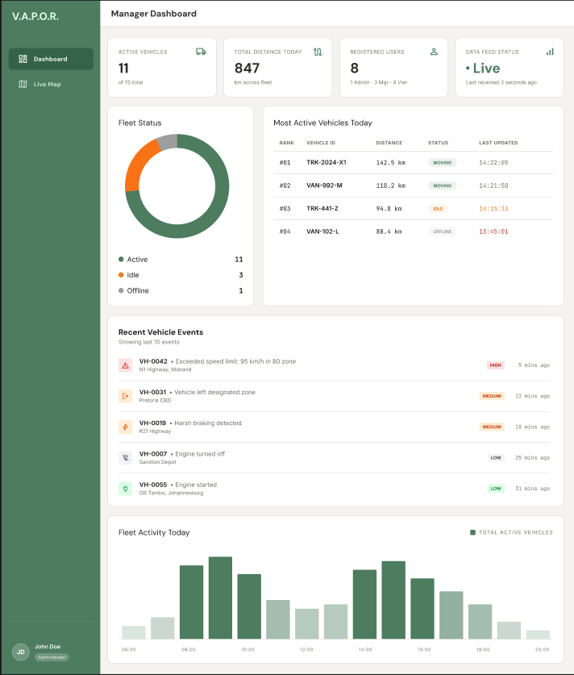
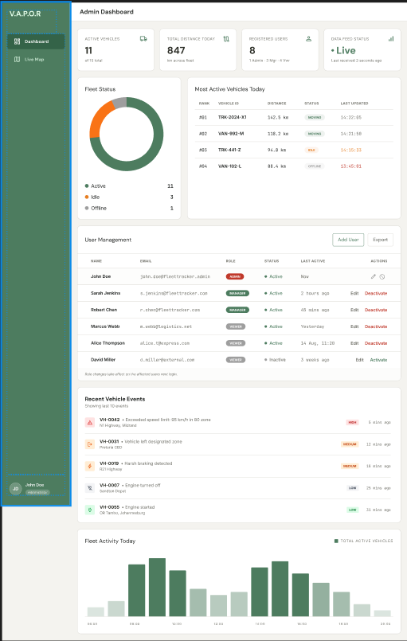

# Screen Reference

The sections below document each screen in the Vehicle Analytics, Processing & Operation in Real Time (V.A.P.O.R). Web wireframes are landscape.
---

## 1. Login Page

**Purpose:** Authenticates existing users with email and password. Provides access recovery options and integration with Google OAuth.

**Key UI Elements:**
- "Welcome back" header
- Email address input field
- Password input field with visibility toggle
- "Remember me" checkbox
- "Forgot password?" link
- Primary "Sign in to dashboard" action button
- "Continue with Google" OAuth button
- Link to registration page ("No account yet? Create one")

**User Interactions:**
- If valid credentials submitted then user redirected to role-based dashboard
- If invalid credentials then error message displayed
- "Forgot password?" clicked then redirected to password recovery flow
- "Continue with Google" clicked then Google OAuth authentication initiated
- "No account yet? Create one" clicked then navigated to Registration page

**Wireframes**

Web (Desktop)

---

## 2. Registration Page

**Purpose:** Allows new users to create an account. Collects full name, email, and password. Enforces password strength requirements and prevents duplicate email registration.

**Key UI Elements:**
- "Create Your Account" header
- Full Name input field
- Email input field
- Password input field with strength indicator
- Password confirmation field
- Password requirements checklist (8+ chars, letter, number, special char)
- "Continue with Google" OAuth button
- Terms and Privacy Policy acceptance checkbox
- Primary "CREATE ACCOUNT" action button
- "Already have an account? Sign in" link

**User Interactions:**
- Valid details submitted → account created, email verification OTP sent, user redirected to OTP verification page
- Already-registered email submitted → error message displayed
- Weak password submitted → inline error specifying requirements
- Password requirements checklist updates in real-time
- "Already have an account? Sign in" clicked → navigated to Login page

**Wireframes**

Web (Desktop)

---

## 3. Email Verification Page

**Purpose:** Prompts users to enter the 6-character OTP sent to their email. Used for both account activation on registration and for password recovery. Users can request a resend if the OTP expires.

**Key UI Elements:**
- Email verification header with envelope icon
- Message showing email address where code was sent
- 6-digit OTP input fields (individual boxes)
- Primary "Verify account" action button
- Timer showing remaining OTP validity (Code expires in MM:SS)
- "Resend code" link (available after expiry or on demand)
- "Back to sign up" link for returning to registration

**User Interactions:**
- Correct OTP entered → account activated, user redirected to dashboard
- Incorrect or expired OTP entered → error shown with resend option
- "Resend code" clicked → new OTP sent, timer resets (subject to rate limits)
- "Back to sign up" clicked → returned to Registration page
- Timer expires → "Resend code" option becomes enabled

**Wireframes**

Web (Desktop)

---

## 4. Viewer Dashboard

**Purpose:** Read-only dashboard for fleet viewers. Displays high-level fleet metrics, live map, and vehicle status summary. Focused on visibility without management capabilities.

**Key UI Elements:**
- Dashboard header with user greeting ("Viewer Dashboard")
- Key Performance Indicators (KPIs) cards:
  - Active Vehicles (11 of 15 total)
  - Total Distance Today (847 kilometres)
- Live Fleet Map showing vehicle locations with status indicators:
  - Green: Moving (9 vehicles)
  - Orange: Speeding (2 vehicles)
  - Gray: Offline (4 vehicles)
- Vehicle Status pie chart showing breakdown by status (Active, Idle, Offline)
- Last updated timestamp (2 seconds ago)
- Left sidebar navigation with Dashboard and Live Map options
- User profile section showing current user name

**User Interactions:**
- Clicking on vehicle on map → displays vehicle details panel with speed, location, trip duration, distance today
- "Live Map" navigation → full-screen map view
- Map zoom and pan controls available
- Vehicle marker indicators update in real-time

**Wireframes**

Web (Desktop)

Web (Desktop - Live Map Focus)

---

## 5. Manager Dashboard

**Purpose:** Operational dashboard for fleet managers. Provides fleet status overview, top performing vehicles, recent events, and activity analytics. Enables vehicle and trip management without user administration.

**Key UI Elements:**
- Dashboard header showing role ("Manager Dashboard")
- Key Performance Indicators (KPIs) cards:
  - Active Vehicles (11 of 15 total)
  - Total Distance Today (847 kilometres)
  - Registered Users (8 users)
  - Data Feed Status (Live indicator)
- Fleet Status pie chart (Active: 11, Idle: 3, Offline: 1)
- Most Active Vehicles Today table showing:
  - Rank, Vehicle ID, Distance, Status, Last Updated timestamp
- Recent Vehicle Events list showing:
  - Event type, severity level, timestamp, vehicle location
  - Events include: Exceeded speed limit, left designated zone, hard braking, engine turned off, engine started
- Fleet Activity Today bar chart showing hourly active vehicle count
- Left sidebar navigation with Dashboard and Live Map options
- User profile section

**User Interactions:**
- Clicking on vehicle in "Most Active Vehicles" table → navigates to vehicle detail view
- Clicking on event in "Recent Vehicle Events" → displays event details and location
- Bar chart interaction → hover for hourly breakdown
- "Live Map" navigation → full-screen map view with all vehicles
- Data automatically refreshes (last received timestamp updates)

**Wireframes**

Web (Desktop)

---

## 6. Admin Dashboard

**Purpose:** System administration dashboard with full platform oversight. Manages users, vehicle assignments, system health, and access control. Restricted to administrators only.

**Key UI Elements:**
- Dashboard header showing role ("Admin Dashboard")
- Key Performance Indicators (KPIs) cards:
  - Active Vehicles (11 of 15 total)
  - Total Distance Today (847 kilometres)
  - Registered Users (8 users)
  - Data Feed Status (Live indicator)
- Fleet Status pie chart (Active: 11, Idle: 3, Offline: 1)
- Most Active Vehicles Today table with same structure as Manager Dashboard
- User Management section showing:
  - User table with columns: Name, Email, Role, Status, Last Active, Actions
  - Role badges: Viewer, Fleet Manager, Admin
  - Status indicators: Active, Inactive
  - Action buttons: Edit, Deactivate for each user
  - "Add User" and "Export" action buttons
- Recent Vehicle Events list
- Fleet Activity Today bar chart
- Left sidebar navigation
- User profile section

**User Interactions:**
- Clicking "Add User" → opens user creation modal
- Clicking "Edit" on user row → opens user edit modal with role assignment options
- Clicking "Deactivate" on user row → deactivates user account (with confirmation)
- Role dropdown in user edit → shows options: Viewer, Fleet Manager, Admin
- Admin role assignment → shows warning about full system access
- "Export" button → exports user list to CSV/Excel
- All manager dashboard interactions also available

**Wireframes**

Web (Desktop)

---

## 7. User Role Assignment Modal

**Purpose:** Allows administrators to assign or modify user roles. Displays role descriptions and warns about full system access for Admin role.

**Key UI Elements:**
- "Edit User Access" modal header
- User email display
- "ASSIGN NEW ROLE" dropdown/selector
- Role options with descriptions:
  - Viewer (Read-only data access)
  - Fleet Manager (Vehicle and trip management)
  - Admin (Full system and user control)
- Warning message for Admin role: "This user will have full system access including user management and the ability to modify other accounts."
- "Cancel" and "Save Changes" action buttons
- Note: "Role changes take effect on the affected users next login."

**User Interactions:**
- Clicking role dropdown → displays available role options
- Selecting different role → updates displayed description and warning (if Admin)
- "Save Changes" → applies role change, modal closes, user list updates
- "Cancel" → closes modal without saving changes
- Admin role selection → displays red warning message

**Wireframes**

Web (Desktop)

